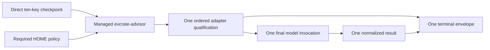

# Advisor Controller and Target Distribution Architecture

**Status**: Central controller, target projections, schema-2 build authorization, and
atomic HOME publication are implemented. Authenticated live vendor-CLI
qualification is a separate operator check.
**Last Updated**: 2026-08-29
**Parent**: [System Architecture](./system-architecture.md)

## Purpose

Every generated harness uses the same managed executable:

```text
~/.evcrate/bin/evcrate-advisor
```

A harness submits one bounded checkpoint object. The controller reads one required
platform-home policy, qualifies one configured backend, runs one final model
process, and emits one controller-authored terminal envelope. The controller is
not a host router, callback bridge, handoff service, provider API, or background
broker.

The first release claim is Linux-only. POSIX process-group cancellation and
owner-only directory modes are covered by the automated contracts. Real
authenticated CLI qualification must be repeated after an installed CLI upgrade;
it is not replaced by generated-file parity or fake-CLI tests.

## Boundaries and ownership

- `.evcrate/source/.claude/` remains the canonical harness authoring tree.
- `.evcrate/source/.evcrate/bin/` is the sole additional canonical authored source
  for the shared controller.
- `.evcrate/source/.claude`, `.codex`, `.agents`, `.gemini`, `.antigravity`,
  `.pi`, and `.omp` are generated target artifacts; they are never hand-edited.
- The controller is copied once to the logical `.evcrate/bin` root and published
  to `$HOME/.evcrate/bin`; no harness owns a controller copy.
- The user-owned `$HOME/.evcrate/advisor-routing.json` is read by the controller,
  is never generated or published, and is never replaced by the publisher.
- Build and publication use the same source/output hashes. Unmanaged HOME files
  remain preserved, while stale managed files are removed according to their
  target policy.

## Required global policy

The policy is required at the platform-home path
`$HOME/.evcrate/advisor-routing.json`. There is no built-in target and no
repository-local policy fallback. The exact version-1 shape is:

```json
{
  "version": 1,
  "advisor": {
    "backend": "codex",
    "model": "gpt-5.6-sol",
    "effort": "high",
    "timeout_ms": 900000
  }
}
```

The top level contains exactly `version` and `advisor`; `advisor` contains
exactly `backend`, `model`, `effort`, and `timeout_ms`. `timeout_ms` is an
integer from 60000 through 900000 inclusive. Model and effort are bounded,
non-empty, control-free strings. Duplicate keys, credentials, unknown backends,
unknown fields, unsafe modes, symlinks, and oversized documents fail closed.
The policy file is read with fatal UTF-8 decoding, is limited to 16 KiB, and is
created/read with owner-only POSIX permissions where supported.

Candidate backend names are exactly `claude`, `codex`, `antigravity`, `pi`, and
`omp`. The enabled set is `claude`, `codex`, `pi`, and `omp`. `antigravity`
remains an explicit candidate slot whose first probe returns
`CLI_CAPABILITY_UNSUPPORTED`; it does not start a model process. `gemini` is not
a candidate or registry member and returns `ADAPTER_UNSUPPORTED` when selected.

A missing policy returns `ROUTE_POLICY_REQUIRED`. A top-level `hosts` policy is
recognized as a migration failure with
`ROUTE_SCHEMA_MIGRATION_REQUIRED`, message
`Global advisor policy requires migration from host routes`, and action
`Replace version 1 hosts with one version 1 advisor object containing backend, model, effort, and timeout_ms.`
No policy field is inherited, merged, substituted, downgraded, retried, or
redirected.

## Checkpoint wire contract

The executable accepts the checkpoint object directly on stdin. There is no outer
operation object, active-host field, route override, executable, argv, credential,
debug, or fallback field. The exact ten keys are:

```json
{
  "protocol": "evcrate-advisor-checkpoint",
  "version": 1,
  "checkpoint": "review:implementation-step",
  "question": "What is the smallest safe next change?",
  "kind": "review",
  "task_or_phase": "Implementation",
  "evidence": {
    "terminal": "Observed test and review evidence.",
    "files": []
  },
  "changed_paths": [],
  "prior_counsel": [],
  "owner_disposition": "Proceed after validation."
}
```

The request is at most 32 KiB and is parsed with fatal UTF-8, duplicate-key,
depth, and control-character checks. `question` is at most 4 KiB, the task or
phase is at most 8 KiB, terminal evidence is at most 16 KiB, there are at most
four evidence files and sixteen changed paths, and all paths are normalized,
relative, POSIX, safe, unique, and free of credentials or metadata locations.
Evidence files are metadata only; they are not read or mounted into the child
workspace.
Idle or partial stdin has a finite two-second pre-policy deadline; expiry emits
one `FAILED` envelope with `TIMEOUT`.

Adapters may return one bounded internal recommendation. Only the controller
creates `evcrate-advisor-result/v1`, including the original checkpoint and
structured recommendation lists. Backend output is never passed through as the
public response.

## One controller transaction

`runController(input, dependencies)` performs one monotonic, fail-closed
transaction:

1. Generate the UUID correlation id before parsing stdin.
2. Parse and validate the direct checkpoint.
3. Load the global policy once and select one registry adapter.
4. Create one empty owner-only temporary workspace and pass it as both `cwd` and
   `workspaceRoot`.
5. Run that adapter's ordered non-model probes under the remaining policy
   deadline.
6. Build one fixed invocation and execute it once.
7. Parse the terminal output once, normalize one result, and emit one envelope.
8. Terminate descendants and remove the workspace in `finally`.

Preflight failure means zero final model launches. A final-process failure remains
a failed checkpoint. There is no backend switch, model substitution, effort
downgrade, retry, callback, or local fallback.

The outer envelope is frozen and has exactly these common fields:

```json
{
  "protocol": "evcrate-advisor-controller",
  "version": 1,
  "correlation_id": "controller-generated-uuid",
  "status": "ADVICE_READY",
  "receipt": {
    "backend": "codex",
    "model": "gpt-5.6-sol",
    "effort": "high",
    "controller_version": 1,
    "adapter_version": "diagnostic-cli-version",
    "elapsed_ms": 1234
  }
}
```

Success adds `result` and uses `ADVICE_READY`. Failure uses `FAILED` and adds
only the sanitized `error` fields `code`, `category`, `action`, and `message`.
The receipt remains present on every failure; fields unknown at the failure
boundary are `null`. Normal stdout contains exactly one JSON line and stderr is
empty. The executable exits zero only for success and one for every failed
checkpoint, including cancellation.

## Adapter qualification

The registry owns one contract per candidate. Enabled adapters use credential-safe
version/auth/capability probes and fixed argv; installed CLIs retain their own
credentials. EVCrate auth-key allowlists are empty.

| Backend | Release status | Contract boundary |
|---|---|---|
| `codex` | Enabled | Diagnostic version, credential-safe login status, help/model probes, fixed no-tool instruction with a read-only runner guard, exact model/effort, and strict terminal lifecycle. |
| `claude` | Enabled | Diagnostic version, JSON auth status, safe plan-mode one-turn JSON execution, explicit model/effort, no session persistence, no tools or MCP. |
| `pi` | Enabled | Diagnostic version, non-refreshing JSON auth check, exact provider/model/thinking attestation, no session/extensions/skills/tools, strict JSONL lifecycle. |
| `omp` | Enabled | Diagnostic version, redacted provider usage auth status, exact provider/model/thinking catalog attestation, no session/tools/LSP/extensions/skills/rules, strict stdin JSONL lifecycle. |
| `antigravity` | Disabled | Unavailable adapter; `CLI_CAPABILITY_UNSUPPORTED` before any model process. |
| `gemini` | Unsupported | Not a candidate or module; `ADAPTER_UNSUPPORTED`. |

Version equality is not a qualification. `probeVersion` records a sanitized
installed-CLI diagnostic string; feature probes must still prove the required
flags, auth boundary, model/effort controls, no-tool isolation, session policy,
and output protocol. Qualification is repeated after CLI upgrades.

## Runner and isolation contract

The shared runner uses `shell:false`, fixed allowlisted argv/environment, stdin-only
prompt delivery, fatal UTF-8 decoding, bounded stdout/stderr/result/line data,
and POSIX detached process groups. Cancellation sends TERM, waits for cleanup,
then sends KILL if required and reaps descendants. Every probe and final
invocation receives a deadline facade clamped to the remaining global
`timeout_ms`; a probe cannot consume an additional final-process budget.

The temporary workspace is empty, owner-only, and outside the repository. The
controller rejects unsafe or symlinked workspace roots and deletes the workspace
only after child termination. Vendor HOME stores remain the only credential
source; policy, checkpoint, result, environment, and test fixtures contain no
credentials.

## Build, hash, and publication gates

The controller closure is rooted at `.evcrate/source/.evcrate/bin` and consists
of the executable plus these production files:

- `lib/advisor/adapter-contract.cjs`, `adapter-registry.cjs`
- `lib/advisor/adapters/claude.cjs`, `codex.cjs`, `pi.cjs`
- `lib/advisor/checkpoint-contract.cjs`, `controller-envelope.cjs`, `controller.cjs`
- `lib/advisor/errors.cjs`, `isolated-workspace.cjs`, `json-document.cjs`
- `lib/advisor/policy-schema.cjs`, `profile.cjs`, `runner.cjs`

The build manifest is schema 2 and records `controller_hashes`, adapter/source
hashes, output hashes, owners, and validation metadata. The source and every
projection must be regular, non-symlink files with the canonical entrypoint
shebang and executable mode. Test, fixture, helper, ignored, and extra files are
rejected.

The publisher has one binding, `.evcrate/bin` to `.evcrate/bin`, at promotion
order 5. It stages a complete directory on the same volume, records a release
marker, renames the prior directory to a backup, atomically promotes the new
directory, and removes the backup only after success. Recovery restores the
complete prior directory from the marker. `$HOME/.evcrate` and its managed `bin`
ancestors must be real owner-controlled directories. The managed directory is
0700 and `evcrate-advisor` is 0755. The policy file and unrelated HOME roots are
not replaced or chmodded.

Build/check and publication are separate operations:

```bash
python3 distribute.py --build
python3 distribute.py --build
python3 distribute.py --check
EVCRATE_HOME="$TEMP_HOME" python3 distribute.py --publish --dry-run --json
```

Generated target workflows and direct hard-fix commands all carry the same
literal `~/.evcrate/bin/evcrate-advisor` path. Change canonical sources or
manifest overlays, rebuild, verify, and publish; do not hand-edit projections.



## Verification boundary

Automated contracts use temporary HOME directories and fake CLIs. They cover
strict input and policy failures, exact argv, isolated cwd, sanitized
environment, output lifecycle, timeout/cancellation, descendant cleanup,
workspace deletion, envelope immutability, stale hash blocking, atomic recovery,
and selected-target publication. They do not authenticate a vendor CLI.

The supported operator qualification is Linux-only and must use each installed
enabled CLI's own authentication flow with a bounded non-sensitive checkpoint.
Verify the exact receipt, one terminal envelope, no tool/session/workspace
artifacts, deadline behavior, and cancellation cleanup. Keep `antigravity`
disabled until equivalent sanitized evidence exists. OMP model policies use an
exact `provider/model` selector and its `usage --json --redact` auth contract.
