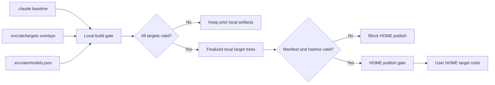

# Advisor Mentoring and Target Distribution Architecture

**Status**: Active; former broker design superseded
**Last Updated**: 2026-08-23
**Parent**: [System Architecture](./system-architecture.md)

**Release note (2026-08-23)**: Explicit advisor mentoring is shipped across the
Claude source and generated Codex, Gemini, and Pi artifacts. Gemini migration now
rewrites advisor workflow references to the generated `.gemini/workflows/` path;
the fallback scout command remains literal Claude syntax by design.

## Purpose

Define reproducible multi-platform generation and the boundary between the portable
`advisor-strategy` rubric, the normal high-tier `advisor` subagent, and forbidden
advisor broker/runtime infrastructure.

## Scope boundary

The `.agents` projection described here is the shared skill distribution; normal
advisor agents are target-specific generated resources. It must not be read as
the native Pi target. [Native Pi Phase 01](./pi-native-migration-phase-01.md)
records the original `.pi` target and shared `agent/settings.json` merge for only
`npm:pi-subagents@0.44.0`, `npm:@juicesharp/rpiv-ask-user-question@2.4.0`, and
`npm:@juicesharp/rpiv-todo@2.4.0`; Phase 03 has since implemented the native
runtime. Release/cutover remains blocked by XML closing-tag marker corruption and
a shell descendant timeout/process-tree leak, and live publication still requires
manual Pi quiescence.

## Architectural Decisions

- `.evcrate/source/.claude` remains the shared baseline authoring source and is the physical source-backed distribution target.
- Build/check validate the complete nested tree, and publication binds its sanitized HOME view to `HOME/.claude` with no subpath limit.
- The local `.evcrate/source/.claude` artifact remains complete, but HOME publication excludes regular files directly under `.claude/skills/` (installation/readme/notices/archives) while retaining skill package directories and nested resources. Stale managed copies absent from the current source are removed; unmanaged HOME paths remain preserved.
- The Codex projection owns the shared Pi-compatible skill tree under `.evcrate/source/.agents/skills`; publication binds it to `$HOME/.agents/skills`, which Pi discovers globally without a settings-file edit.
- Authored and generated Pi-distributed `SKILL.md` files require YAML frontmatter with a lower-kebab-case `name` and non-empty `description`; generated command skills use `cmd_*` directories, lower-kebab-case frontmatter names, and descriptions capped at 1,024 characters.
- `.evcrate/targets/<target>` owns target-only files and explicit config patches.
- Local `.evcrate/source/.claude`, `.evcrate/source/.agents`, `.evcrate/source/.codex`, `.evcrate/source/.gemini`, and other target trees are finalized artifacts.
- HOME distribution consumes finalized local artifacts only and preserves declared user-owned configuration.
- Generic publication preserves unmanaged HOME files; stale or incomplete manifests, output drift, and symlinks in managed artifacts or unsafe HOME paths are rejected.
- `.evcrate/source/.claude/skills/advisor-strategy/` is the canonical advisor source and migrates to `.evcrate/source/.agents/skills/advisor-strategy/` with its brief contract.
- Each generated `cmd_*` skill contains one static pointer recommending explicit `$advisor-strategy` use. The pointer does not activate the skill.
- `.evcrate/source/.claude/agents/advisor.md` is the canonical mentor. It uses
  `model: opus`, activates `advisor-strategy`, and migrates through the existing
  target policies (`gpt-5.6-sol/high` in Codex, target-native pro in Gemini, and
  semantic `strong` in Pi).
- Scoped implementation commands recognize a final standalone `@advisor`, remove
  only that token from work input, and call the normal advisor once after every
  terminal reviewer result. Without the token they call it only after the same
  blocker repeats twice without progress.
- No advisor MCP server, hook, broker, launcher, provider selector, quota, ledger,
  audit, permission bypass, or isolation claim is distributed.

## Distribution Data Flow



### Local build gate

1. Validate source and target manifests.
2. Generate baseline into same-volume temporary staging.
3. Append declared target-only files.
4. Apply only exact, allowlisted key patches.
5. Validate schemas, ownership, collisions, and hashes.
6. Write build manifest.
7. Atomically promote staging to local target trees.

Build failure must not mutate the last valid local artifacts or HOME.

### HOME publish gate

1. Read finalized local artifacts and build manifest.
2. Reject stale, failed, missing, or hash-mismatched builds.
3. Compute create/update/delete/preserve diff per HOME target.
4. Stage and promote each target with release/recovery metadata.

After changing `.evcrate/source/.claude`, run `python3 distribute.py --all`, or run `python3 distribute.py --build` followed by `python3 distribute.py --publish`. `--publish` requires a current verified build, never runs migrators, and publishes the sanitized HOME view of the complete `.evcrate/source/.claude` artifact to `$HOME/.claude`. The advisor skill's `.agents` publication does not create or modify `~/.pi/agent/settings.json`; the separate native Pi Phase 01 target owns its documented shared-settings merge.

`python3 distribute.py --all --target pi` (also `npm run distribute:pi`) narrows stage, manifest verification, and HOME bindings to `.pi → $EVCRATE_HOME/.pi`. It still takes the repository build lock and HOME-wide publication lock, verifies a newly built Pi artifact, merges Pi shared settings, and retains pi-code, symlink, recovery, and concurrent-HOME-change guards. Use `--publish --target pi --dry-run --json` only to inspect an existing verified Pi artifact; do not use a direct migrator or copy. Omitting `--target` remains all-target.

No migration or overlay logic runs during publication.

## Ownership and Collision Invariants

- Every finalized path has one owner: baseline generator or named target overlay.
- New overlay paths append normally.
- File, directory, or config-key collisions fail by default.
- Intentional config changes require an exact destination and allowed key paths.
- Shared generated configuration cannot be replaced wholesale.
- Managed publication deletes only manifest-owned paths, including stale paths recorded from the previous release when absent from the current source.
- User-owned HOME paths remain preserved unless explicit full policy says otherwise.
- Concurrent build/publish operations require a repository/release lock.

## Advisor Mentoring Flow

```text
Developer runs an implementation command
  -> command parses optional final standalone @advisor
  -> code-reviewer returns a terminal report
  -> explicit mode: normal advisor subagent receives a bounded brief
  -> default mode: advisor is called only on second matching blocker
  -> executor records advice and keeps normal test/review/human gates
```

The skill remains static guidance and cannot independently inspect evidence, call
a model, or enforce a verdict. The `advisor` agent is the ordinary host delegation
that applies that guidance at a high-tier model policy. It cannot edit files,
approve changes, select providers, or bypass host permissions, sandboxing, tests,
code review, tool approvals, or human review.

Claude, Gemini, and Pi can enforce the canonical read/search tool declaration.
Codex custom-agent migration records the source allowlist as a comment because the
host has no equivalent per-agent tool allowlist; its read-only boundary is therefore
prompt- and host-policy-enforced, not a security isolation claim.

## Compatibility Note

The unshipped `advisor_consult` interface and its target-owned broker, admission
hook, runtime launcher, registry, quota ledger, and audit behavior remain removed.
Commands use only the normal subagent mechanism already provided by each host.
Advisor output is non-binding mentorship, not an approval or enforced isolation
boundary. Generic MCP and hook support remain unchanged.

## Validation Gates

- Generated skill frontmatter and brief contract are present.
- The generated advisor agent exists and retains the target's high-tier/strong
  model mapping without embedding cross-provider routing in prompt prose.
- Every generated `cmd_*` skill has exactly one non-invoking pointer.
- Scoped command guides preserve suffix parsing, review ordering, cook pass-through,
  and deterministic stuck escalation.
- Reviewer/advisor execution is bounded by the documented three-cycle contract;
  user approval remains required before finalization.
- Repeated migration is byte-identical.
- Generated config, hooks, target manifest, and build manifest contain no advisor runtime wiring.
- Staged build and publish dry-run preserve declared user-owned configuration.

## Known follow-up defects

These were accepted with the current implementation and are intentionally tracked
for the next run:

- `/code*` variants do not yet enforce the three-cycle cap consistently.
- `/code:auto` does not yet handle advisor must-fix guidance and default-mode
  behavior consistently.
- `/cook` fallback routes can still lose the trailing `@advisor` token.
- Tests run without provider credentials and start no App Server, MCP server, app, or model call.

## References

- [Replacement plan](../plans/260802-1726-skill-only-advisor/plan.md)
- [System architecture](./system-architecture.md)
- [Superseded broker plan](../plans/260802-0249-advisor-two-gate-distribution/plan.md)
