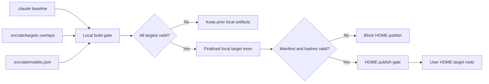

# Advisor Mentoring and Target Distribution Architecture

**Status**: Active; former broker design superseded
**Last Updated**: 2026-08-23
**Parent**: [System Architecture](./system-architecture.md)

**Phase 02 note (2026-08-23)**: The canonical Claude source and focused
regression coverage now define final standalone `--advice`, ordinary `@advisor`
input, and named review/stuck/decision checkpoints. Generated Codex, Gemini,
Antigravity, Pi, and `.agents` projections are intentionally not regenerated in
Phase 02; Phase 04 owns that rollout. The earlier Gemini migration rewrites
advisor workflow references to the generated `.gemini/workflows/` path; its
fallback scout command remains literal Claude syntax by design.

## Purpose

Define reproducible multi-platform generation and the boundary between the portable
`advisor-strategy` rubric, the normal high-tier `advisor` subagent, and forbidden
advisor broker/runtime infrastructure.

## Scope boundary

The `.agents` projection described here is the shared skill distribution; normal
advisor agents are target-specific generated resources. It must not be read as
the native Pi target. [Native Pi Phase 01](./pi-native-migration-phase-01.md)
records the original `.pi` target and shared `agent/settings.json` merge for only
`npm:pi-subagents@0.44.0`, `npm:@juicesharp/rpiv-ask-user-question@2.4.0`, and
`npm:@juicesharp/rpiv-todo@2.4.0`; Phase 03 has since implemented the native
runtime. Release/cutover remains blocked by XML closing-tag marker corruption and
a shell descendant timeout/process-tree leak, and live publication still requires
manual Pi quiescence.

## Architectural Decisions

- `.evcrate/source/.claude` remains the shared baseline authoring source and is the physical source-backed distribution target.
- Build/check validate the complete nested tree, and publication binds its sanitized HOME view to `HOME/.claude` with no subpath limit.
- The local `.evcrate/source/.claude` artifact remains complete, but HOME publication excludes regular files directly under `.claude/skills/` (installation/readme/notices/archives) while retaining skill package directories and nested resources. Stale managed copies absent from the current source are removed; unmanaged HOME paths remain preserved.
- The Codex projection owns the shared Pi-compatible skill tree under `.evcrate/source/.agents/skills`; publication binds it to `$HOME/.agents/skills`, which Pi discovers globally without a settings-file edit.
- Authored and generated Pi-distributed `SKILL.md` files require YAML frontmatter with a lower-kebab-case `name` and non-empty `description`; generated command skills use `cmd_*` directories, lower-kebab-case frontmatter names, and descriptions capped at 1,024 characters.
- `.evcrate/targets/<target>` owns target-only files and explicit config patches.
- Local `.evcrate/source/.claude`, `.evcrate/source/.agents`, `.evcrate/source/.codex`, `.evcrate/source/.gemini`, and other target trees are finalized artifacts.
- Phase 02 changes the canonical Claude source and focused regression assertions
  only. Generated target trees are not hand-edited or regenerated in this phase;
  Phase 04 owns their advisory-capability rollout and parity checks.
- HOME distribution consumes finalized local artifacts only and preserves declared user-owned configuration.
- Generic publication preserves unmanaged HOME files; stale or incomplete manifests, output drift, and symlinks in managed artifacts or unsafe HOME paths are rejected.
- `.evcrate/source/.claude/skills/advisor-strategy/` is the canonical advisor source and migrates to `.evcrate/source/.agents/skills/advisor-strategy/` with its brief contract.
- Each generated `cmd_*` skill contains one static pointer recommending explicit `$advisor-strategy` use. The pointer does not activate the skill.
- `.evcrate/source/.claude/agents/advisor.md` is the canonical mentor. It uses
  `model: opus`, activates `advisor-strategy`, and migrates through the existing
  target policies: Codex selects `gpt-5.6-sol` with high reasoning, Gemini uses
  target-native `pro`, and Pi uses semantic `strong` (which resolves to
  `openai-codex/gpt-5.6-sol` with high reasoning when that provider is active).
- Phase 02-scoped `/code`, `/cook`, `/fix`, and `/bootstrap` implementation
  commands recognize exactly one case-sensitive, whitespace-delimited final
  standalone `--advice` (trailing whitespace allowed), remove only that token
  into `WORK_ARGUMENTS`, and reject duplicate standalone tokens. Non-final,
  quoted, embedded, suffixed, or differently cased forms remain ordinary input;
  `--advice` alone follows normal empty-input behavior.
- Every `@advisor` occurrence, including an exact final token, is ordinary
  unchanged work input. The final `@advisor` behavior was the Phase 01 contract;
  Phase 02 removes it as an active mode because host file/location syntax makes
  it ambiguous.
- Explicit `--advice` review calls use a fresh normal advisor after each
  terminal reviewer result. The shared contract also names
  `review:<workflow-step>`, `stuck:<blocker-signature>`, and
  `decision:<workflow-step>` checkpoints; default mode escalates only on the
  second matching blocker, and uncovered irreversible/security/go-no-go
  decisions use the existing decision point rather than inventing new ones.
- The shared prompt and workflow impose an explicit hard cap of at most three
  terminal reviewer/advisor cycles; `/code:no-test` intentionally imposes a
  lower one-cycle limit. Each consultation forwards relevant prior counsel and
  owner disposition explicitly.
- `/code:auto` applies every explicit advisor must-fix item before approval and
  does not invent advisor guidance in default mode. Cook variants and `/fix:hard`
  preserve `WORK_ARGUMENTS` through fallback handoffs, appending exactly one
  trailing `--advice` in explicit mode and no mode token otherwise.
- No advisor MCP server, hook, broker, launcher, provider selector, quota, ledger,
  audit, permission bypass, or isolation claim is distributed.

## Distribution Data Flow



### Local build gate

1. Validate source and target manifests.
2. Generate baseline into same-volume temporary staging.
3. Append declared target-only files.
4. Apply only exact, allowlisted key patches.
5. Validate schemas, ownership, collisions, and hashes.
6. Write build manifest.
7. Atomically promote staging to local target trees.

Build failure must not mutate the last valid local artifacts or HOME.

### HOME publish gate

1. Read finalized local artifacts and build manifest.
2. Reject stale, failed, missing, or hash-mismatched builds.
3. Compute create/update/delete/preserve diff per HOME target.
4. Stage and promote each target with release/recovery metadata.

After changing `.evcrate/source/.claude`, run `python3 distribute.py --all`, or run `python3 distribute.py --build` followed by `python3 distribute.py --publish`. `--publish` requires a current verified build, never runs migrators, and publishes the sanitized HOME view of the complete `.evcrate/source/.claude` artifact to `$HOME/.claude`. The advisor skill's `.agents` publication does not create or modify `~/.pi/agent/settings.json`; the separate native Pi Phase 01 target owns its documented shared-settings merge.

`python3 distribute.py --all --target pi` (also `npm run distribute:pi`) narrows stage, manifest verification, and HOME bindings to `.pi → $EVCRATE_HOME/.pi`. It still takes the repository build lock and HOME-wide publication lock, verifies a newly built Pi artifact, merges Pi shared settings, and retains pi-code, symlink, recovery, and concurrent-HOME-change guards. Use `--publish --target pi --dry-run --json` only to inspect an existing verified Pi artifact; do not use a direct migrator or copy. Omitting `--target` remains all-target.

No migration or overlay logic runs during publication.

## Ownership and Collision Invariants

- Every finalized path has one owner: baseline generator or named target overlay.
- New overlay paths append normally.
- File, directory, or config-key collisions fail by default.
- Intentional config changes require an exact destination and allowed key paths.
- Shared generated configuration cannot be replaced wholesale.
- Managed publication deletes only manifest-owned paths, including stale paths recorded from the previous release when absent from the current source.
- User-owned HOME paths remain preserved unless explicit full policy says otherwise.
- Concurrent build/publish operations require a repository/release lock.

## Advisor Mentoring Flow

```text
Developer runs an implementation command
  -> command parses optional exact final --advice into WORK_ARGUMENTS
  -> normal workflow reaches a named review, stuck, or decision checkpoint
  -> terminal prerequisite evidence is supplied to a fresh advisor subagent
  -> default mode escalates only on the second matching blocker
  -> at most three terminal reviewer/advisor cycles, then user direction
  -> executor records advice and keeps normal test/review/human gates
```

The Phase 02 contract is implemented in the canonical Claude source. Generated
target projections retain their prior release state until Phase 04; they are not
evidence that the new contract has been rolled out. Cook discovery/planning and
all cook fallbacks pass `WORK_ARGUMENTS`; `/fix:hard` is included in the scoped
fallback preservation rule. Explicit mode is preserved exactly once across each
canonical handoff.

The skill remains static guidance and cannot independently inspect evidence, call
a model, or enforce a verdict. The `advisor` agent is the ordinary host delegation
that applies that guidance at a high-tier model policy. It cannot edit files,
approve changes, select providers, or bypass host permissions, sandboxing, tests,
code review, tool approvals, or human review.

Claude, Gemini, and Pi can enforce the canonical read/search tool declaration.
Codex custom-agent migration records the source allowlist as a comment because the
host has no equivalent per-agent tool allowlist; its read-only boundary is therefore
prompt- and host-policy-enforced, not a security isolation claim.

## Compatibility Note

The unshipped `advisor_consult` interface and its target-owned broker, admission
hook, runtime launcher, registry, quota ledger, and audit behavior remain removed.
Commands use only the normal subagent mechanism already provided by each host.
Advisor output is non-binding mentorship, not an approval or enforced isolation
boundary. Generic MCP and hook support remain unchanged.

## Phase 02 Validation Gates

- Canonical skill frontmatter, brief contract, and one-shot advisor report are
  present.
- Canonical scoped command guides preserve final-only parsing, ordinary
  `@advisor` input, named checkpoint ordering, prior-counsel forwarding, cook
  and `/fix:hard` pass-through, and deterministic stuck escalation.
- Reviewer/advisor execution is bounded by a hard cap of at most three terminal
  cycles (or a lower command-specific limit); user approval remains required
  before finalization.
- Focused canonical and migrator regression tests pass without model, app, MCP,
  or App Server calls.
- No active `@advisor` alias, provider selector, broker, or approval bypass is
  introduced.

## Deferred Phase 04 Generated-Target Rollout

Phase 04 owns regeneration and parity validation for Codex, Gemini, Pi,
Antigravity, and `.agents`, including target-specific advisor mapping and any
target capability markers. Until that phase is complete, existing generated
trees remain unchanged; do not hand-edit them or claim that they implement the
Phase 02 `--advice` contract.

## Advisor command-mode hardening status

The four previously tracked command-mode follow-ups are resolved in the
canonical Claude source and its focused regression coverage. Generated target
projections are intentionally deferred to Phase 04:

- All four `/code` variants enforce the shared hard cap and advisor-before-fix or
  approval ordering; `/code:no-test` keeps its intentional one-cycle limit.
- `/code:auto` distinguishes reviewer critical items from advisor must-fix items,
  applies the latter before approval, and leaves default mode without invented
  advisor guidance.
- `/cook`, `/cook:auto`, `/cook:auto:fast`, and `/cook:auto:parallel` preserve
  explicit mode through fallback handoffs, and `/fix:hard` is covered by the same
  scoped fallback rule.
- Regression tests remain intentionally credential-free and start no App Server,
  MCP server, app, or model call; this is test isolation, not an unresolved
  canonical advisor defect.

## Subsequent Advisory Phases

The following work is outside Phase 02 and remains planned:

- Phase 03 adds `/advise` as a separate inline-first interview workflow and,
  where supported, a tested Claude `--agent` relay with resumable state.
- Phase 04 projects the Phase 02 checkpoint contract and Phase 03 capability
  boundaries to generated targets. Unsupported target relays must be rejected
  explicitly rather than inferred from projected files.
- The canonical-source/build/check ownership model and the forbidden broker,
  MCP, launcher, provider-selector, quota, ledger, audit, and approval-bypass
  boundary remain in force.

## References

- [Canonical advisor workflow](../.evcrate/source/.claude/workflows/advisor-mentoring.md)
- [System architecture](./system-architecture.md)
- [Native Pi Phase 01](./pi-native-migration-phase-01.md)
