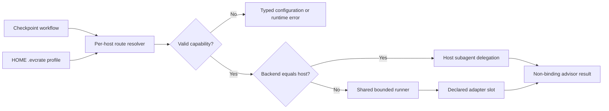
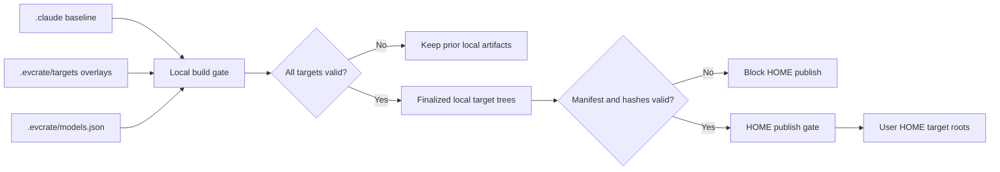

# Advisor Mentoring and Target Distribution Architecture

**Status**: Phase 04 adapter contracts implemented; Phase 07
projection/manifest integration deferred
**Last Updated**: 2026-08-25
**Parent**: [System Architecture](./system-architecture.md)

**Design revision (2026-08-25)**: Checkpoint advice gains one host-aware
dispatcher. Each host owns an independent route to a native advisor or a
declared built-in installed-CLI adapter. One global
`$HOME/.evcrate/advisor-routing.json` owns all host entries; same-host routes
remain native and cross-host routes resolve to one of five named adapter slots.
Phase 02 validates the resolver/runner contract and Phase 04 adds concrete
adapter contracts with capability gates; Gemini and Antigravity remain
fail-closed where a deny-write boundary is not evidenced. Phase 07
projection/manifest integration remains deferred. This intentionally supersedes the former blanket
ban on launchers/provider selection while retaining the bans on arbitrary
command templates, direct provider APIs, credential storage, background broker
services, and approval bypasses.

**Release note (2026-08-24)**: The canonical source, generated Codex, Gemini,
Antigravity, Pi, and `.agents` projections now define final standalone
`--advice`, ordinary `@advisor` input, named review/stuck/decision checkpoints,
and target-native inline `/advise`. Claude alone retains relay v1; all other
targets explicitly reject it. The earlier Gemini migration rewrites advisor
workflow references to the generated `.gemini/workflows/` path; its fallback
scout command remains literal Claude syntax by design. Codex and Antigravity
checkpoint commands prefer their project-local workflow path and fall back to
the published HOME workflow (`~/.codex/workflows/` and
`~/.gemini/config/workflows/`) when no local override exists.

## Purpose

Define reproducible multi-platform generation and the boundary between the
portable `advisor-strategy` rubric, independent per-host routes, native advisor
delegation, built-in external CLI adapters, and forbidden arbitrary broker/runtime
infrastructure.

## Scope boundary

The `.agents` projection described here is the shared skill distribution; normal
advisor agents are target-specific generated resources. It must not be read as
the native Pi target. [Native Pi migration](./pi-native-migration.md) records
the `.pi` target and shared `agent/settings.json` merge for only
`npm:pi-subagents@0.44.0`, `npm:@juicesharp/rpiv-ask-user-question@2.4.0`, and
`npm:@juicesharp/rpiv-todo@2.4.0`; Phase 03 implemented the native runtime and
Phase 04 completed its generated-target rollout and parity checks. Release
publication remains user-controlled and requires manual Pi quiescence; this
documentation describes the verified build/check boundary, not automatic live
cutover.

## Architectural Decisions

- `.evcrate/source/.claude` remains the shared baseline authoring source and is the physical source-backed distribution target.
- Build/check validate the complete nested tree, and publication binds its sanitized HOME view to `HOME/.claude` with no subpath limit.
- The local `.evcrate/source/.claude` artifact remains complete, but HOME publication excludes regular files directly under `.claude/skills/` (installation/readme/notices/archives) while retaining skill package directories and nested resources. Stale managed copies absent from the current source are removed; unmanaged HOME paths remain preserved.
- The Codex projection owns the shared Pi-compatible skill tree under `.evcrate/source/.agents/skills`; publication binds it to `$HOME/.agents/skills`, which Pi discovers globally without a settings-file edit.
- Authored and generated Pi-distributed `SKILL.md` files require YAML frontmatter with a lower-kebab-case `name` and non-empty `description`; generated command skills use `cmd_*` directories, lower-kebab-case frontmatter names, and descriptions capped at 1,024 characters.
- `.evcrate/targets/<target>` owns target-only files and explicit config patches.
- Local `.evcrate/source/.claude`, `.evcrate/source/.agents`, `.evcrate/source/.codex`, `.evcrate/source/.gemini`, and other target trees are finalized artifacts.
- Phase 02 changed the canonical Claude source and focused regression assertions
  only. Generated target trees were not hand-edited or regenerated in that phase;
  Phase 04 completed their advisory-capability rollout and parity checks.
- HOME distribution consumes finalized local artifacts only and preserves declared user-owned configuration.
- Generic publication preserves unmanaged HOME files; stale or incomplete manifests, output drift, and symlinks in managed artifacts or unsafe HOME paths are rejected.
- `.evcrate/source/.claude/skills/advisor-strategy/` is the canonical advisor source and migrates to `.evcrate/source/.agents/skills/advisor-strategy/` with its brief contract.
- Each generated `cmd_*` skill contains one static pointer recommending explicit `$advisor-strategy` use. The pointer does not activate the skill.
- `.evcrate/source/.claude/agents/advisor.md` is the canonical mentor. It uses
  `model: opus`, activates `advisor-strategy`, and migrates through the existing
  target policies: Codex selects `gpt-5.6-sol` with high reasoning, Gemini uses
  target-native `pro`, and Pi uses semantic `strong` (which resolves to
  `openai-codex/gpt-5.6-sol` with high reasoning when that provider is active).
- Phase 02-scoped `/code`, `/cook`, `/fix`, and `/bootstrap` implementation
  commands recognize exactly one case-sensitive, whitespace-delimited final
  standalone `--advice` (trailing whitespace allowed), remove only that token
  into `WORK_ARGUMENTS`, and reject duplicate standalone tokens. Non-final,
  quoted, embedded, suffixed, or differently cased forms remain ordinary input;
  `--advice` alone follows normal empty-input behavior.
- Every `@advisor` occurrence, including an exact final token, is ordinary
  unchanged work input. The final `@advisor` behavior was the Phase 01 contract;
  Phase 02 removes it as an active mode because host file/location syntax makes
  it ambiguous.
- Explicit `--advice` review calls use a fresh normal advisor after each
  terminal reviewer result. The shared contract also names
  `review:<workflow-step>`, `stuck:<blocker-signature>`, and
  `decision:<workflow-step>` checkpoints; default mode escalates only on the
  second matching blocker, and uncovered irreversible/security/go-no-go
  decisions use the existing decision point rather than inventing new ones.
- The shared prompt and workflow impose an explicit hard cap of at most three
  terminal reviewer/advisor cycles; `/code:no-test` intentionally imposes a
  lower one-cycle limit. Each consultation forwards relevant prior counsel and
  owner disposition explicitly.
- `/code:auto` applies every explicit advisor must-fix item before approval and
  does not invent advisor guidance in default mode. Cook variants and `/fix:hard`
  preserve `WORK_ARGUMENTS` through fallback handoffs, appending exactly one
  trailing `--advice` in explicit mode and no mode token otherwise.
- No advisor MCP server, arbitrary command template, direct provider API,
  credential store, quota ledger, audit transport, permission bypass, or
  isolation claim is distributed. Only declared built-in CLI adapters may start
  an invocation-scoped external advisor process.

## Advisor Route and Dispatcher Contract

One logical profile contains independent entries for `claude`, `codex`,
`gemini`, `antigravity`, and `pi`:

```json
{
  "version": 1,
  "hosts": {
    "codex": {
      "backend": "codex",
      "model": "gpt-5.6-sol",
      "effort": "high",
      "execution": "auto"
    }
  }
}
```

Resolve the platform user-home directory through the user-home API, never shell
expansion or the repository working directory, and read exactly
`<home>/.evcrate/advisor-routing.json`. A repository-local policy is ignored.
Route precedence is the complete active-host entry in that global file, then
the built-in same-host default. V1 has no host-native-config or per-invocation
override; missing host entries do not inherit from another host. The file is
user-owned, is never published or generated, and contains no authentication
material. Implementations must reject unsafe/symlinked files where the platform
can prove that property, use owner-only POSIX modes for EVCrate-created
directories/files, and document Windows ACL limits without claiming POSIX
guarantees.

`execution: auto` uses native delegation only when `backend == host` and the
native host can express the exact model and effort. Cross-host routes use the
shared runner and the named built-in adapter. `native` is valid only when
`backend == host`; `external` is valid only when `backend != host`. Same-host
external execution is rejected even if native metadata cannot express the exact
selector. All modes fail closed on unsupported capability; no model substitution,
effort downgrade, route inheritance, backend switch, or execution-mode fallback
is allowed.

The resolver's route truth table is strict:

| Backend relation | `execution` | Resolver action | Result |
| --- | --- | --- | --- |
| Same host | `auto` | Native | Exact native model/effort capability check |
| Same host | `native` | Native | Exact native model/effort capability check |
| Same host | `external` | Reject | `ROUTE_EXECUTION_INVALID` |
| Different supported host | `auto` | External | Selected declared adapter slot |
| Different supported host | `external` | External | Selected declared adapter slot |
| Different supported host | `native` | Reject | `ROUTE_EXECUTION_INVALID` |

Native capability checks are exact: a model mismatch is `MODEL_UNSUPPORTED` and
an effort mismatch is `EFFORT_UNSUPPORTED`; neither falls back to another host
profile or a weaker selector. The bundled Gemini capability record is
`model: "pro", efforts: []` because Gemini CLI 0.47.0 exposes no exact effort
control. Its built-in `pro`/`high` route therefore fails closed with
`EFFORT_UNSUPPORTED` until a verified equivalent is advertised.

The shared runner owns cancellation, timeout, process-tree cleanup, bounded
stdout/stderr, diagnostic redaction, and typed error normalization. Each adapter
owns executable/version/auth probing, exact model/effort validation, argv-only
construction, stdin prompt delivery, structured result parsing, and backend
error classification. The child receives a bounded read-only checkpoint brief,
inherits no EVCrate credentials, and carries an unforgeable-by-prompt advisory
marker; a nested dispatcher call fails as recursion.

Route descriptors, loaded policy/capability documents, error definitions,
`AdvisorRoutingError` instances, and serialized error objects are frozen.
Resolver/dispatcher JSON exposes only the stable sanitized fields
`code`, `category`, `action`, and `message`; it does not expose policy bytes,
filesystem paths, credentials, causes, or raw process diagnostics. Unknown
failures normalize to the stable process error rather than leaking details.

The registry declares concrete adapter contracts for Claude, Codex, Gemini,
Antigravity, and Pi. Exact capability gates still fail closed when a selected
CLI cannot evidence the requested effort/read-only boundary; Gemini's bundled
native route therefore reports `EFFORT_UNSUPPORTED`, and the reviewed
Antigravity boundary remains explicitly gated. No authenticated external CLI
is production-enabled. Each adapter owns its exact
executable/version, model, effort/thinking, headless, structured-output,
read-only, session, auth, and cancellation contract. Capability gaps fail at
route validation: for example, Gemini CLI 0.47.0 exposes no exact effort flag,
and the reviewed future fixture lacks a verified deny-write boundary.
Deterministic fake-CLI tests define the adapter contract; authenticated live
calls remain separately approved work. Antigravity's
`.antigravity` path stays a logical generated target; its physical
Gemini-compatible publication mapping remains isolated in the existing
publisher.



## Distribution Data Flow



### Local build gate

1. Validate source and target manifests.
2. Generate baseline into same-volume temporary staging.
3. Append declared target-only files.
4. Apply only exact, allowlisted key patches.
5. Validate schemas, ownership, collisions, and hashes.
6. Write build manifest.
7. Atomically promote staging to local target trees.

Build failure must not mutate the last valid local artifacts or HOME.

### HOME publish gate

1. Read finalized local artifacts and build manifest.
2. Reject stale, failed, missing, or hash-mismatched builds.
3. Compute create/update/delete/preserve diff per HOME target.
4. Stage and promote each target with release/recovery metadata.

After changing `.evcrate/source/.claude`, run `python3 distribute.py --build`
and `python3 distribute.py --check`; repeat the build when checking
determinism. `--publish` is separate authorization: it requires a current
verified build, never runs migrators, and publishes the sanitized HOME view of
the complete `.evcrate/source/.claude` artifact to `$HOME/.claude`. The advisor
skill's `.agents` publication does not create or modify `~/.pi/agent/settings.json`; the separate native Pi Phase 01 target owns its documented shared-settings merge.

`python3 distribute.py --all --target pi` (also `npm run distribute:pi`) narrows stage, manifest verification, and HOME bindings to `.pi → $EVCRATE_HOME/.pi`. It still takes the repository build lock and HOME-wide publication lock, verifies a newly built Pi artifact, merges Pi shared settings, and retains pi-code, symlink, recovery, and concurrent-HOME-change guards. Use `--publish --target pi --dry-run --json` only to inspect an existing verified Pi artifact; do not use a direct migrator or copy. Omitting `--target` remains all-target.

No migration or overlay logic runs during publication.

### Routing runtime closure and Phase 02 boundary

The validated production routing closure is sixteen files:
`advisor-dispatch.cjs`, ten shared files under `advisor-routing/`, and five
adapter modules under `advisor-routing/adapters/`:

- `adapter-contract.cjs`, `adapter-registry.cjs`, `checkpoint-contract.cjs`,
  `errors.cjs`, `json-document.cjs`
- `native-capabilities.json`, `policy-schema.cjs`, `profile.cjs`,
  `resolve-route.cjs`, `runner.cjs`
- `adapters/antigravity.cjs`, `adapters/claude.cjs`,
  `adapters/codex.cjs`, `adapters/gemini.cjs`, `adapters/pi.cjs`

The reviewer’s “seven runtime files” wording counted the dispatcher plus an
earlier six-file subset. It is historical shorthand, not the current closure.
Distribution inventory tests resolve all sixteen imports and keep generated
target presence separate from runtime capability evidence. Phase 04 keeps the
canonical closure and focused tests as the boundary. It does not regenerate
production projections or update build-manifest integration; Phase 07 owns
that projection/manifest delivery.

The implemented numeric bounds are 16 KiB for policy/request documents, 256
bytes for model names, 64 bytes for effort names, and 32 KiB for a checkpoint
brief. Runner defaults are 64 KiB stdout, 16 KiB stderr, 2,048 lines, 48 KiB
result, 30 seconds, and 250 ms of termination grace. POSIX descendant cleanup
is covered by focused tests; Windows uses direct-child termination and its
process-tree behavior remains unvalidated and deferred.

## Ownership and Collision Invariants

- Every finalized path has one owner: baseline generator or named target overlay.
- New overlay paths append normally.
- File, directory, or config-key collisions fail by default.
- Intentional config changes require an exact destination and allowed key paths.
- Shared generated configuration cannot be replaced wholesale.
- Managed publication deletes only manifest-owned paths, including stale paths recorded from the previous release when absent from the current source.
- User-owned HOME paths remain preserved unless explicit full policy says otherwise.
- Concurrent build/publish operations require a repository/release lock.

## Advisor Mentoring Flow

```text
Developer runs an implementation command
  -> command parses optional exact final --advice into WORK_ARGUMENTS
  -> normal workflow reaches a named review, stuck, or decision checkpoint
  -> terminal prerequisite evidence is supplied to the host route dispatcher
  -> dispatcher validates and starts one fresh native or external advisor
  -> default mode escalates only on the second matching blocker
  -> at most three terminal reviewer/advisor cycles, then user direction
  -> executor records advice and keeps normal test/review/human gates
```

The contract is implemented in canonical Claude and projected through the
deterministic build. Cook discovery/planning and all cook fallbacks pass
`WORK_ARGUMENTS`; `/fix:hard` is included in the scoped fallback preservation
rule. Explicit mode is preserved exactly once across each canonical handoff.

The skill remains static guidance and cannot independently inspect evidence, call
a model, or enforce a verdict. The dispatcher, not the skill or advisor, selects
the validated per-host route. A same-host route uses ordinary host delegation; a
cross-host route uses one bounded built-in adapter. Neither path can edit files,
approve changes, bypass host permissions, sandboxing, tests, code review, tool
approvals, or human review.

Claude, Gemini, and Pi can enforce the canonical read/search tool declaration.
Codex custom-agent migration records the source allowlist as a comment because the
host has no equivalent per-agent tool allowlist; its read-only boundary is therefore
prompt- and host-policy-enforced, not a security isolation claim.

## Compatibility Note

The unshipped `advisor_consult` interface and its target-owned broker, admission
hook, long-lived service, registry, quota ledger, and audit behavior remain
removed. The new dispatcher is a local routing contract, not a resurrection of
that broker: it uses normal subagent delegation or one declared adapter slot
per invocation when an implementation is enabled. Advisor output is non-binding
mentorship, not an approval or enforced isolation boundary. Generic MCP and hook
support remain unchanged.

## Historical Phase 02 Validation Gates

- Canonical skill frontmatter, brief contract, and one-shot advisor report are
  present.
- Canonical scoped command guides preserve final-only parsing, ordinary
  `@advisor` input, named checkpoint ordering, prior-counsel forwarding, cook
  and `/fix:hard` pass-through, and deterministic stuck escalation.
- Reviewer/advisor execution is bounded by a hard cap of at most three terminal
  cycles (or a lower command-specific limit); user approval remains required
  before finalization.
- Focused canonical and migrator regression tests pass without model, app, MCP,
  or App Server calls.
- No active `@advisor` alias, broker, or approval bypass was introduced. The
  host-aware route selector is the explicit later design revision documented
  above.

## Phase 04 Generated-Target Rollout

Phase 04 regenerated and parity-checked Codex, Gemini, Pi, Antigravity, and
`.agents` from the canonical Claude source. Generated trees remain derived
artifacts: update `.evcrate/source/.claude` or a declared target overlay, then
run the distribution build/check gates; do not hand-edit generated files.

Advisory capability markers are a strict contract. The canonical command and
interview workflow each contain one bounded marker block. The shared
distribution contract validates the block's presence, order, uniqueness, and
contents before projecting it to a target. Each projection records its target
identity and emits the native inline `/advise` behavior. Only canonical Claude
retains the `interview-relay/v1` path; Codex, Gemini, Pi, and Antigravity reject
an exact final standalone `--agent` with their target-specific unsupported
capability code before delegation or relay-state handling.

Generated help is part of the parity gate. Its target-aware self-test checks
that every generated target names its own target, describes inline advise
behavior, and documents the matching `ADVISE_AGENT_RELAY_UNSUPPORTED_<TARGET>`
rejection. The help script must remain correct when copied to a target-specific
script directory, not only when run from the canonical Claude tree.

## Historical Phase 02 command-mode hardening

The four previously tracked command-mode follow-ups are resolved in the
canonical Claude source and its focused regression coverage. Phase 04 completed
the generated-target projection and parity gates:

- All four `/code` variants enforce the shared hard cap and advisor-before-fix or
  approval ordering; `/code:no-test` keeps its intentional one-cycle limit.
- `/code:auto` distinguishes reviewer critical items from advisor must-fix items,
  applies the latter before approval, and leaves default mode without invented
  advisor guidance.
- `/cook`, `/cook:auto`, `/cook:auto:fast`, and `/cook:auto:parallel` preserve
  explicit mode through fallback handoffs, and `/fix:hard` is covered by the same
  scoped fallback rule.
- Regression tests remain intentionally credential-free and start no App Server,
  MCP server, app, or model call; this is test isolation, not an unresolved
  canonical advisor defect.

## Phase 03 Canonical Claude Capability

Phase 03 is implemented in `.evcrate/source/.claude` as the canonical Claude
capability. Phase 04 supplied the generated-target projections, strict
capability validation, target-native inline command behavior, and generated
help parity checks described above.

- `/advise [prompt-or-url]` runs an inline-first interview in the main session.
  It asks one concise question at a time (at most eight discovery questions),
  requires explicit `confirm` or `correct` for one reframed problem (at most
  two confirmation/correction cycles), then writes a sanitized report to the
  active `<plan>/reports` directory or `plans/reports` and links it.
- `/advise [prompt-or-url] --agent` enables the Claude `interview-relay/v1`
  only when `--agent` is one exact final standalone token. Duplicate flags
  reject; quoted, embedded, non-final, or differently cased forms remain
  ordinary prompt input. The main session remains the sole user interlocutor
  and report writer.
- Relay state is invocation-scoped, temporary, owner-only, bounded, sanitized,
  and untracked. Paused/failed state is retained for seven days and a completed
  invocation leaves a 24-hour tombstone. Cancellation, interruption,
  unavailable-model, malformed-envelope, state, or report failures fail closed;
  relay never silently falls back to inline mode.
- Codex, Pi, Gemini, and Antigravity reject `--agent` explicitly with their
  target-specific unsupported capability code. Generated-file presence is not
  support evidence; the build/check and target-aware help tests are the support
  evidence, and generated targets must not be hand-edited.
- The canonical-source/build/check ownership model and the forbidden broker,
  MCP, arbitrary launcher, direct provider API, quota, ledger, audit, and
  approval-bypass boundary remain in force. Checkpoint dispatcher routes are
  the sole built-in adapter exception; inline interview/relay semantics do not
  consume them.

## References

- [Advisor supervision migration](./advisor-supervision-migration.md)
- [Canonical advisor workflow](../.evcrate/source/.claude/workflows/advisor-mentoring.md)
- [Canonical `/advise` command](../.evcrate/source/.claude/commands/advise.md)
- [Canonical advisory interview workflow](../.evcrate/source/.claude/workflows/advisory-interview.md)
- [System architecture](./system-architecture.md)
- [Native Pi migration](./pi-native-migration.md)
