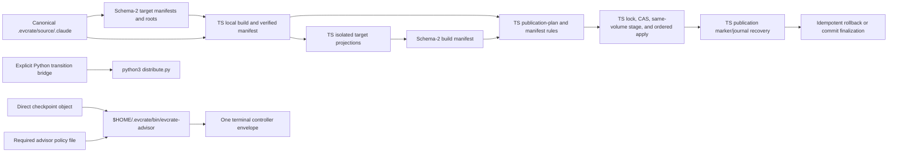

# System Architecture

**Last Updated**: 2026-09-02  
**Project**: EVCrate  
**Status**: Phase 10 TypeScript release packaging and per-target cutover complete; release remains Unreleased

## Scope

EVCrate has two cooperating planes:

1. The TypeScript/npm control plane is the default release engine. It parses
   bounded requests, validates target and policy data, builds/verifies target
   projections, publishes HOME artifacts, and recovers interrupted releases.
2. The Python distribution plane remains an explicit compatibility path for
   transition overrides and authority-parity tests; it is not in the packaged
   runtime.

Canonical Claude resources are authored under `.evcrate/source/.claude/`.
Generated target projections are derived artifacts. Phase 6 adds a schema-v1
resource registry and explicit import transaction; Phase 7 adds package-local
scope state, revision-vector CAS, typed preview hash/token bindings, and a
separate advisor-settings coordinator. Phase 8 adds TypeScript current-build
resolution, deterministic HOME publication planning, manifest-driven merges,
same-volume staged promotion, durable target-publication state, retention, and
idempotent recovery. Phase 10 adds per-target cutover receipts, uniform-engine
rejection, TypeScript manifest generation, Python-free package execution, and
the final release boundary.

## Architecture at a glance



The TypeScript publication path is the default engine and the Python
compatibility path is explicit; both consume the same verified build contract
but are never one mixed-engine transaction. The controller path is a separate
shared advisory service. It is not a per-target projection, distribution broker,
or settings mutation path.

## Phase 8 atomic publication and recovery

Phase 8 added a TypeScript target-publication path under `src/distribution/`.
It consumes a current, complete schema-2 build and selected target manifests;
it does not run target migrators/adapters during publish or recover and does not
mutate advisor settings. Phase 8 established the staging, parity, and recovery
contract; Phase 10 promotes this path to the default after the per-target gates.

### Build closure and publication plan

`build-resolution.ts` selects target manifests, resolves the target-specific or
all-target build-manifest path, requires complete validation metadata, derives
current canonical source/manifest/adapter/output paths and hashes, checks
owners and HOME policy parity, and delegates digest checks to `verifyBuild`.
Stale source, adapters, manifests, controller bytes, output roots, ownership,
or policy cause publication failure before mutation.

`publication-rules.ts` is a closed policy interpreter. Only
`omp-agent-prefix`, `codex-home-path-rewrite`, and
`claude-skill-root-exclusion` are accepted, and each is owned by its named
target. OMP maps published files below `agent/`; Codex rewrites HOME hook and
MCP-wrapper paths; Claude excludes root-level `skills/<name>` files. Behavior
is never inferred from destination names.

`publication-inventory.ts` walks roots in canonical order under bounded file,
directory, byte, depth, and path limits. It rejects symlinks/special entries,
checks owner-controlled ancestors, records device/inode/size/mode metadata, and
computes complete tree or controller hashes. Marker parsing accepts the strict
TypeScript target-publication schema and the compatible Python marker schema.

`publication-plan.ts` creates immutable controller and selected-target binding
plans. It maps source files to contained HOME destinations and emits exact
`create`, `update`, `delete`, `preserve`, `noop`, `merge-*`, and `conflict`
operations with before snapshots and intended hashes. Prior marker-managed
paths identify stale deletions; unmanaged collisions remain conflicts.

The binding order is fixed and validated:

```text
.evcrate/bin (controller, 5)
.gemini (10)
.agents (20)
.codex (20)
.pi (25)
.gemini/config (30)
.omp (30)
.claude (40)
.copilot (40)
```

### Shared JSON policy ports

`jsonc.ts` supplies bounded JSONC scanning for comments, trailing commas,
duplicate keys, nesting, node count, invalid strings, and trailing data while
retaining source spans. `managed-json.ts` uses those spans to replace only the
exact `managed-json-v1` top-level keys, preserving unrelated JSONC keys,
comments, newline style, and BOM. Type/root/key mismatches fail closed; equal
values return byte-identical `noop`.

`pi-settings.ts` handles the manifest's `pi-settings-v1` package key. It
preserves unrelated entries and object shapes, pins the three declared packages,
and reports a conflict for `pi-code` (including versioned/object identities)
without removing it. `shared-json.ts` dispatches only these two schemas; OMP
has no shared-JSON operation.

### Apply and recovery state machine

The distribution exports `publicationStateRoot`, `createPublicationPlan`,
`publishDryRun`, `publishApply`, and `recoverPublication`.
State is under `$HOME/.evcrate/publication`: owner-only
`publication-journal.json`, `release-marker.json`, and `release-<id>/stage`
and `backups` directories. Dry-run is non-mutating. Apply acquires the shared
publication lock, recovers a prior journal, checks same-volume placement,
recomputes snapshots, stages controller/files, renames prior destinations to
identity-checked backups, promotes in binding order, syncs parent directories,
and verifies intended snapshots after each rename.

The schema-1 journal binds release identity, home root, selected targets,
binding order, build-manifest digest, managed paths, operation count/digest,
before snapshots, intended hashes, backups, and promotion state. A committed
apply writes a complete marker, clears the active journal, and retains at most
one prior release subject to 512 MiB and seven-day limits. Failures before
promotion restore the previous marker; failures after promotion call
`recoverPublicationUnlocked`.

`publication-recovery.ts` validates owner/mode, containment, target/binding
associations, marker/journal identity, operation digests, node identities, and
intended content before mutation. It restores the previous complete state as
`rolled-back`, finalizes a committed state as `finalized`, and returns `none`
when no journal exists. Recovery is idempotent and never recursively deletes
an unexpected replacement. The target marker/journal are isolated from the
separate advisor-settings lock, token, policy, and recovery transaction.

The typed resource operations are `publish.dry-run`, `publish.apply`, and
target-only `recover`; the CLI validates their selected-target/binding
correlation. The default path executes TypeScript publication and recovery.
The compatibility bridge compares Python dry-run operations and the Python
release marker only when an explicit transition engine selects it.

## Phase 10 release packaging and per-target cutover

`src/distribution/cutover.ts` stores one immutable `TargetGateReceipt` per
persisted target: `claude`, `gemini`, `antigravity`, `codex`, `pi`, `omp`, and
`copilot`. Each receipt records `authoritativeEngine`, parity and closure
verification, schema version 2, cutover timestamp, and notes. The default
engine is TypeScript; an explicit target override can select Python for
transition testing. `assertUniformAuthoritativeEngine` rejects a selected set
that would mix engines, preventing split or partial atomic publication.

### Build and manifest generation

`npm run build` runs `scripts/generate-controller-inventory.mjs` first. The
generator writes `src/manifests/controller-inventory.generated.ts`, whose
exact 17-file list authorizes the CommonJS controller closure. The generated
file is consumed by source/projection validators and is never hand-edited.

`node scripts/build-manifests.mjs` calls `runLocalBuild` for each persisted
target, then for the aggregate target set. `local-build-staging.ts` creates
isolated target stages, runs the registered TypeScript projection adapter,
validates declared roots, copies the controller closure, computes source,
adapter, controller, owner, output, and HOME-policy records, and writes
`.evcrate/build-manifest-<target>.json` or `.evcrate/build-manifest.json`.
`runLocalCheck` repeats staging and fails on output or manifest drift.

### Package and runtime boundary

The npm package exposes the CommonJS `evcrate` and `evcrate-advisor` bins.
Phase 10 packed-artifact checks require compiled `dist/**`, target manifests,
verified build manifests, and one controller closure; they reject
`distribution/`, migrator, and legacy adapter Python trees, `__pycache__`, and
Python bytecode. The default TypeScript CLI therefore runs without a Python
interpreter. The repository compatibility bridge remains for explicit
transition/parity tests and is not the packaged default.

Build/check/publish/recover do not run migrators on the TypeScript path.
Publication consumes a current verified build, applies manifest rules in the
fixed binding order, preserves unmanaged data and separate advisor settings,
and recovers only identity-checked target state. The exact 17-file controller
remains a singleton and its checkpoint/counsel contract is unchanged; `health`
uses only its qualification diagnostic.

### Phase 10 evidence

`npm run test:phase10` passes **8/8**, covering seven gate receipts, alias and
uniform-engine selection, controller closure, target/aggregate manifest
generation, legacy-root cleanup, packed Python-free allow-list checks, and
pure TypeScript CLI routing. Full validation passes **255/255** tests. The
evidence covers the feature worktree and packed artifact contract; operator
rollout, live vendor qualification, npm publication, deployment behavior, and
`main` merge remain outside this phase.


## Ownership and component boundaries

| Component | Source | Responsibility | Authority |
|---|---|---|---|
| Canonical resources | `.evcrate/source/.claude/` | Agent, command, hook, workflow, and skill authoring | Repository author |
| Target registry | `.evcrate/targets/manifest.json` and target manifests | Persisted target IDs, adapters, roots, patches, overlays, and HOME policy | Schema-2 manifest contract |
| TypeScript control plane | `src/cli/`, `src/context/`, `src/protocol/`, `src/manifests/`, `src/distribution/` | One-shot CLI, strict contracts, context, manifest/build authorization, cutover, publication, and recovery | Default release engine |
| Resource registry | `src/registry/` | Schema-v1 canonical resource records, manifest-root scanning, compatibility, bounded list/get, and registry revisions | Canonical source plus manifest-derived roots |
| Scope state | `src/scopes/` | Package-local global/project assignments, inheritance, disablement, project identity, revision vectors, and scope CAS | Scope protocol and package-local state |
| Explicit imports | `src/imports/` | Bounded source descriptors, capability approvals, preview tokens, adapter projections, and CAS-bound apply | Typed resource protocol |
| TypeScript transactions | `src/filesystem/`, `src/distribution/{build-resolution,local-build,local-build-staging,cutover,publication-rules,publication-inventory,publication-plan,publication,publication-recovery,shared-json,managed-json,pi-settings,jsonc}.ts`, `src/advisor-settings/` | Paths, hashes, locks, build/cutover gates, manifest generation, target publication, policy CAS, recovery, and import atomicity | Default release engine |
| Python distribution | `distribution/`, `distribute.py` | Compatibility build/check/publication/recovery and parity reference | Explicit transition path |
| Generated projections | `.evcrate/source/.agents`, `.codex`, `.gemini`, `.antigravity`, `.omp`, `.copilot`, `.pi` | Target-specific derived trees | Never hand-edited |
| Shared advisor controller | `.evcrate/source/.evcrate/bin` → `$HOME/.evcrate/bin` | Checkpoint qualification and one final advisory invocation | Existing CommonJS controller |

The TypeScript compatibility bridge invokes package-relative `python3
distribute.py` with one exact action and the resolved state-root handoff only
when an explicit Python engine is selected. It does not invoke migrators
directly. The packaged default path has no Python interpreter dependency.

The target manifest registry contains exactly seven persisted targets. `agy` is
accepted only at the input boundary and normalizes to `antigravity`; it is never
stored as a second target.

Each target is built by a registered TypeScript adapter in `src/adapters/`.
The manifest `adapter` and `adapter_sources` values below remain parity/hash
references to legacy Python implementations; they are not invoked by the
packaged TypeScript default path.

| Target | Local output roots | Manifest adapter/parity reference | HOME binding | Promotion order |
|---|---|---|---|---:|
| `gemini` | `.gemini` | `migrate_claude_to_gemini.py` | `.gemini` | 10 |
| `codex` | `.codex`, `.agents` | `migrate_claude_to_codex.py` | `.codex`, `.agents` | 20 |
| `pi` | `.pi` | `migrate_claude_to_pi.py` | `.pi` | 25 |
| `antigravity` | `.antigravity` | `migrate_claude_to_gemini.py` | `.gemini/config` | 30 |
| `omp` | `.omp` | `migrate_claude_to_omp.py` | `.omp` | 30 |
| `claude` | `.claude` | none | `.claude` | 40 |
| `copilot` | `.copilot` | `migrate_claude_to_copilot.py` | `.copilot` | 40 |

The shared controller is an additional `.evcrate/bin` publication binding at
order 5. It is not copied into a target harness.

## Phase 6 resource registry and explicit imports

Phase 6 separates resource discovery from distribution declarations. The target
manifest remains schema 2 and authoritative for target adapters, output/HOME
ownership, and promotion policy. Its single `resource_roots` map declares the
five canonical resource roots (`skill`, `agent`, `workflow`, `command`, and
`hook`). The resolver retains the manifest-derived `resourceRoot` assumption:
it reads `.evcrate/targets/manifest.json`, infers the repository from that
path, and resolves each declared root below `.evcrate/source/.claude`. The
implementation does not imply support for alternate layouts or arbitrary roots.

The separate `.evcrate/registry.json` is schema 1. A document contains an
integer revision and canonical, code-point-sorted resource records. Each record
has a stable `kind:canonical-relative-path` ID, source path, mode-aware content
hash, provenance, all seven persisted-target compatibility entries, detected
capabilities, optional model metadata, and a record revision. It does not copy
target manifests, output roots, HOME bindings, controller files, or advisor
policy.

### Discovery and queries

Scanning checks owner-controlled canonical roots, rejects symlinks and special
entries, and hashes the canonical tree before discovering resources. Granularity
is explicit: skills are directories containing `SKILL.md`; agents and workflows
are root-level Markdown files; commands are Markdown files below their root;
hooks are root-level files or directories. Sensitive path segments are excluded
from discovery. Record count, document size, tree depth, file count, byte, and
path limits bound the work, and entries are sorted by Unicode code-point order.
`resources.list` accepts kind/target/status filters, a code-point cursor, and a
bounded limit (default 50, maximum 100). `resources.get` resolves one validated
resource ID. A loaded document is rescanned and compared for content,
capability, compatibility, ownership, and revision consistency; stale or empty
registries cannot hide an existing canonical tree.

Compatibility is derived from the registered projection adapters, not supplied
by an import caller. The registry requires an exhaustive seven-target adapter
set and records `native`, `needsAdapter`, or `unsupported` with a reason for
unsupported entries. Missing adapters or incompatible selected targets fail
closed before projection work.

### Preview, approval, and apply

`imports.preview` is explicit and non-mutating with respect to canonical source,
the registry, target manifests, generated projections, controller files,
advisor policy, HOME paths, and managed settings. It validates a bounded source
descriptor, copies canonical source into an owner-only staging root, materializes
the proposed resource there, rescans it, and runs selected adapters into
separate temporary output stages. Hooks and script content are classified but
never executed. The only durable preview state is an owner-only, single-use
token under `stateRoot/import-previews`; its canonical record is bounded to
128 KiB and expires after a caller-selected lifetime from 1 to 900 seconds
(default 300).

Source imports are bounded to 1,000 files, 64 MiB total, 16 MiB per file, 100,000
directories, depth 32, and 4 KiB per relative path. Sources must be regular
files/directories with stable device/inode/size/mode metadata and no unsafe
ancestors. Executable bits, script suffixes, and shebangs require explicit
`script-execution` approval; every hook requires `hook-execution` approval.

An apply loads and validates the owner-only token, rejects expiry or replay, and
recomputes every preview binding before mutation: source hash/identity, canonical
current/prospective hashes, registry revision/file identity, selected targets,
target-registry and manifest hashes, adapter hashes, projection output hashes,
destination, provenance, approvals, and resource record. Source identity includes
device/inode/size/mode; registry identity includes digest plus those metadata;
complete canonical hashes include file and directory modes; promotion snapshots
include node kind, device/inode, size, mode, and digest. A mode-only change is
therefore a CAS conflict.

For a create or update, canonical source and `.evcrate/registry.json` are
promoted as one staged, same-volume transaction under the publication lock.
Durable backup/journal state and pre-backup/pre-promotion CAS checks prevent a
concurrent replacement from being overwritten; the token is consumed only after
success. An identical re-import returns `unchanged`, consumes its token, and
does not advance the registry revision.

| Destination state | Import result |
|---|---|
| No registry record and no destination node | Create a managed record and node. |
| Existing record with the same provenance and matching kind | Replace in staging; report `update` or `unchanged`. |
| Existing record with different provenance, or a kind mismatch | `CAS_CONFLICT`; preserve the existing node. |
| Destination node without a matching managed record | `CAS_CONFLICT`; never delete or adopt unmanaged content. |

The residual security scope remains the low same-UID/path-race window and
Linux-first security scope. The manifest-derived `resourceRoot` assumption and
the explicit Python compatibility bridge remain documented boundaries.

## Phase 7 scopes, advisor settings, and CAS

Scope state is persisted under the package-local `.evcrate/scopes/` root:
`global.json` and `projects/<opaque-project-id>.json`. A project ID is the
SHA-256 digest of canonical absolute project-root UTF-8 bytes; raw project paths
never appear in scope filenames or bounded protocol output. Global assignments
are inherited by projects when absent; project assignments override them, and an
explicit disabled assignment suppresses inheritance.

Every scope document has a monotonic revision. Resource mutations carry the
explicit `{registryRevision,globalScopeRevision,projectScopeRevision|null}`
vector. `changes.preview|apply` persists owner-only single-use tokens binding the
operation, vector, selected targets, canonical/registry/manifest/adapter hashes,
independent output-root hashes, and expiry. Apply rechecks all bindings at the
mutation boundary and consumes the token only after success; scope mutations use
the package-local `scopes.lock`.

Advisor settings has a separate coordinator and canonical `advisor-settings.lock`.
Frozen v1 complete-document request-file input is canonicalized before preview;
opaque revisions bind policy bytes plus file identity and mode. Single-use tokens,
whole-document atomic apply, and a dedicated journal/recovery path detect manual
edits, recreation, mode/identity changes, replay, and expiry. Settings, scope, and
target-publication transactions never share atomicity or recovery markers.

The accepted model boundary remains explicit: authored agent model frontmatter is
static resource content, commands and workflows have no model-binding field, and
mutable resource model operations are deferred pending a concrete override
contract.


## One-shot TypeScript control-plane flow

```text
CLI argv or one request file
        │
        ▼
strict argument/request parsing
        │
        ▼
immutable package, target, HOME, state, and project context
        │
        ▼
one typed dispatch
  ├─ version / health
  ├─ settings / resources / scopes
  └─ distribution / publish / recover
                │
                ▼
TypeScript handler
  (explicit Python compatibility bridge only when selected)
                │
                ▼
       validate and write one result
                │
                ▼
               exit
```

The CLI has no listener, daemon, retry loop, background worker, counsel proxy,
arbitrary launcher, or Node distribution fallback. Child processes use fixed
argument arrays, `shell: false`, allowlisted environment, bounded streams and
lines, deadlines, abort handling, descendant cleanup, and reaping.

## Phase 4 distribution-safety architecture

### Manifest and build authorization

Target manifests are schema 2. Their path-bearing values are normalized relative
POSIX paths. Adapter and helper sources must be regular, non-symlink files;
obsolete per-harness advisor-runtime fields are rejected. Output roots are
contained declarations, and selected manifest sets reject equal or nested roots,
so output ownership cannot overlap. HOME bindings must cover declared roots,
remain unique, and respect parent-before-child promotion order.

Patch authorization is checked before a build can be trusted:

- source is a regular file under the target manifest's `patches/` root;
- destination is normalized, unique across patch declarations, and inside one
  declared output root;
- keys are non-empty, unique, valid dotted JSON paths with no empty segments and
  no invalid JSON string text.

Owned source paths are limited to the manifest's `files/` subtree. Project
metadata entries are root-level names. A build manifest is schema 2 and contains
exactly `schema_version`, `source_hashes`, `adapter_hashes`, `controller_hashes`,
`owners`, `output_hashes`, `validation`, and `home_policy`.

The TypeScript build-manifest reader uses a 4 MiB maximum and descriptor-stable
bounded reads. It requires `validation.complete === true`, then compares current
source, adapter, output, and controller hashes. Missing, extra, stale, changed,
symlinked, or malformed inputs fail closed before publication.

### Controller inventory and closure

The sole controller source is `.evcrate/source/.evcrate/bin`. The canonical
inventory is exactly these 17 production files:

```text
evcrate-advisor
lib/advisor/adapter-contract.cjs
lib/advisor/adapter-registry.cjs
lib/advisor/adapters/claude.cjs
lib/advisor/adapters/codex.cjs
lib/advisor/adapters/omp.cjs
lib/advisor/adapters/omp-parser.cjs
lib/advisor/adapters/pi.cjs
lib/advisor/checkpoint-contract.cjs
lib/advisor/controller-envelope.cjs
lib/advisor/controller.cjs
lib/advisor/errors.cjs
lib/advisor/isolated-workspace.cjs
lib/advisor/json-document.cjs
lib/advisor/policy-schema.cjs
lib/advisor/profile.cjs
lib/advisor/runner.cjs
```

The inventory is generated by `scripts/generate-controller-inventory.mjs` into
`src/manifests/controller-inventory.generated.ts`. Source and projection checks
require regular files, reject symlinks and extra production entries, reject test,
fixture, helper, fake, and ignored artifacts, and require literal imports to
stay inside the listed closure or Node built-ins. The entrypoint must have the
canonical Node shebang and executable mode. `controller_hashes` must contain
exactly the 17 `.evcrate/bin/...` keys and current SHA-256 bytes; a projection
must be byte-identical.

### Python-compatible canonical JSON and hashing

The control-plane serializer matches Python authority behavior for supported
values: object keys sort by Unicode code point, arrays retain order, undefined
object fields are omitted, and numeric/exponent rendering uses Python-compatible
forms. Canonical bytes are UTF-8; build-manifest bytes end with one newline.
SHA-256 is the only digest algorithm.

The strict parser accepts only object or array roots. Before validation it rejects
invalid UTF-8, control characters, unpaired surrogates, duplicate object keys,
non-finite numbers, trailing JSON data, and nesting deeper than 16 levels. JSON
and canonical documents remain bounded at 64 KiB by default. Tree hashes include
empty directories and file digests in global lexical path order; symlinks and
unsupported entries fail closed. Local dependency/compiler artifacts are
excluded according to source/artifact hash mode.

### Paths, ownership, and staged roots

Path helpers reject absolute paths, backslashes, NULs, dot/dot-dot or empty
segments, symlinked ancestors, non-regular entries, and escapes from a declared
root. Managed roots and ancestors must be real owner-controlled directories;
owner-only modes apply to transaction state on POSIX.

Build/promotion sources must come from a capability-backed staged root on the
same volume as the destination parent. The staged-root capability records its
path plus device/inode identity and is checked before use. Cleanup verifies the
same owner-controlled directory, atomically renames it to a random quarantine
name, rechecks identity, and only then removes it. If the path was replaced,
cleanup refuses recursive deletion.

### Durable promotion and recovery

Promotion snapshots each source and destination (presence, kind, device/inode,
size, mode, and digest), creates a 0700 backup directory, and writes an owner-
only durable journal. Immediately before every backup or promotion rename it
rechecks the relevant snapshot. A source or destination change is a CAS failure;
concurrent replacements are never overwritten.

The journal records contained backup and destination paths, original presence,
intended source hashes, and commit state. Promotion commits the journal only
after all roots are moved, syncs the parent directory, and removes backups only
after success. Recovery validates owner, symlink, containment, and digest
invariants, restores the prior complete set for an interrupted transaction, and
leaves unexpected user replacements untouched. Committed deletions remain
deletions.

### Shared locks and release state

The publication critical section uses an owner-only state directory and a shared
`O_EXCL` JSON lock. TypeScript exposes `publish.lock`, package-local
`scopes.lock`, and the canonical `advisor-settings.lock`; Python's `publish_lock`
uses the same publication lock shape and metadata. Scope and settings locks are
not interchangeable with target publication.

Lock metadata is bounded to 4 KiB and contains a safe PID, millisecond start
time, random 32-hex token, and optional process-start token. On Linux,
`/proc/<pid>/stat` process-start data detects PID reuse. A valid stale lock is
atomically renamed to a random quarantine path, re-read, matched by
token/device/inode identity, and removed. Malformed, changing, or uncertain
metadata blocks acquisition. Release removes a lock only if token and
device/inode identity still match; otherwise it leaves the lock for recovery.

The release marker is owner-only schema-1 JSON, atomically written and bounded
at 4 MiB. Missing state yields an explicit empty marker. Symlinked, malformed,
unsupported, oversized, or unstable marker data fails closed.

### Advisor policy-file transaction boundary

Advisor policy files are bounded at 16 KiB and must be owner-only regular files
without symlinked ancestors. Reads return a validated safe policy view, canonical
bytes, mode, and a revision derived from file metadata and bytes. Staging checks
the expected revision and writes canonical bytes to a sibling staging file.

Apply writes `prepared`, `backed_up`, and `promoted` journal states, performs
source/destination revision CAS checks before backup and promotion, moves the old
complete document to an identity-checked backup, promotes the staged document,
verifies bytes and mode, then clears journal and backup state. Recovery restores
the previous complete policy or accepts a fully promoted document; unsafe
transaction paths and replacement directories fail closed.
The functional `advisor settings get|preview|apply` coordinator is available
through the frozen v1 complete-document request-file contract. It uses the
canonical `advisor-settings.lock` and settings-specific journal/recovery; it
never joins scope or target-publication atomicity. Positional preview/apply remain
behind the request-file boundary.

## Shared advisor controller boundary

Checkpoint workflows send one direct ten-field
`evcrate-advisor-checkpoint/v1` object to the managed
`$HOME/.evcrate/bin/evcrate-advisor`. The required user-owned policy is one
version-1 advisor object; there is no host-route fallback, caller-selected
executable, callback broker, retry, backend switch, model substitution, or local
fallback. The controller qualifies one configured adapter, runs one final model
process in an empty owner-only workspace, and emits one frozen terminal envelope.

The controller is authored once, published as a complete directory, and covered
by the exact inventory/hash closure above. Generated target roots do not own a
controller copy. See [Advisor distribution architecture](./advisor-distribution-architecture.md)
for the full controller and operator qualification contract.

The TypeScript engine is authoritative for target generation, build/check, HOME
publication, and cutover after Phase 10 receipts. The TypeScript modules
implement the verified-build, manifest-policy, planning, staging, ordered
promotion, marker/journal, retention, and recovery contract. The compatibility
bridge compares Python dry-run operations and validates the Python release
marker only when an explicit transition engine selects it; it never mixes
Python and TypeScript mutations in one transaction.

Publication is separate from generation: a failed build or stale hash cannot
replace local or HOME artifacts, and the TypeScript publisher never runs
migrators. The implementation does not claim live vendor-CLI qualification,
npm publication, deployment behavior, or Windows security equivalence.
Remaining review residuals are the low same-UID/path-race window and Linux-first
security scope.

## Evidence and release boundary

Focused implementation evidence records all builds passing. Phase 10
`npm run test:phase10` passed **8/8**, and full validation passed **255/255**.
Phase 8 `npm run test:phase8` passed **54/54** across protocol, CLI,
publication planning, apply, recovery, parity, and isolation contracts.
Earlier aggregate evidence remains **133/133** across Phase 7 (**16/16**),
protocol (**20/20**), CLI (**31/31**), Phase 6 (**23/23**), Phase 4 (**31/31**),
and Phase 5 (`npm run test:phase5`, **12/12**). Phase 7 final review was
approved with no findings.

Phase 10 tests cover gate receipts for all seven targets, alias and
uniform-engine selection, exact controller closure, target/aggregate manifest
generation, legacy-root cleanup, packed Python-free allow-list checks, and
pure TypeScript CLI routing. They do not qualify installed vendor CLIs,
authorize operator rollout, establish deployment behavior, or claim npm
publication or `main` merge. The remaining security scope is Linux-first, with
the low same-UID/path-race window retained as the documented residual.

## Related documentation

- [Codebase Summary](./codebase-summary.md)
- [Code Standards](./code-standards.md)
- [Project Overview and PDR](./project-overview-pdr.md)
- [Advisor distribution architecture](./advisor-distribution-architecture.md)
- [Advisor supervision migration](./advisor-supervision-migration.md)
- [Native Pi migration](./pi-native-migration.md)
- [Repository changelog](../CHANGELOG.md)
