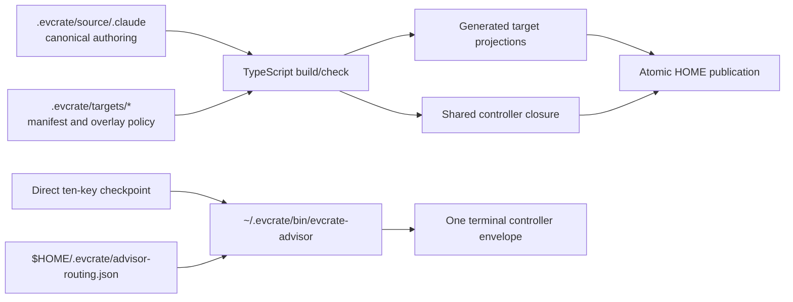

# System Architecture

**Status:** Current implementation reference  
**Updated:** 2026-09-05  
**Authority:** TypeScript control plane and the canonical advisor controller source

This document is the central authority for distribution, advisor supervision, wire
contracts, isolation, and publication. The [codebase summary](./codebase-summary.md)
provides the source map; the [project overview and PDR](./project-overview-pdr.md)
turns these contracts into requirements.

## 1. System shape

EVCrate is a private npm package (`evcrate`, version `1.0.0`) for building and
publishing one canonical agent-harness source tree into seven persisted target
projections. Node `>=22.19.0` is the package engine. The package exposes:

- `evcrate` → `dist/cli/evcrate.js`, the one-shot TypeScript control-plane CLI.
- `evcrate-advisor` → `.evcrate/source/.evcrate/bin/evcrate-advisor`, the shared
  CommonJS checkpoint controller.

The control plane resolves an immutable invocation context, validates one request,
dispatches one operation, writes one result, and exits. It does not run a daemon,
listener, background broker, or provider router.



## 2. Ownership and generated boundaries

| Area | Owner | Editing rule |
|---|---|---|
| Canonical harness resources | `.evcrate/source/.claude/` | Author here; do not hand-edit projections. |
| Shared advisor controller | `.evcrate/source/.evcrate/bin/` | Author the controller closure here. |
| Target policy | `.evcrate/targets/*/manifest.json` and declared overlays | Change policy/overlays, then rebuild. |
| Generated projections | `.evcrate/source/.agents`, `.codex`, `.gemini`, `.antigravity`, `.pi`, `.omp`, `.copilot` | Generated output; never hand-edit. |
| Controller publication | `$HOME/.evcrate/bin/` | Publisher owns one shared copy; no target owns a copy. |
| Advisor routing policy | `$HOME/.evcrate/advisor-routing.json` | User-owned input; never generated, published, replaced, or chmodded by EVCrate. |
| Resource registry | `.evcrate/registry.json` | Schema-1 resource records; separate from schema-2 target/build manifests. |

The target registry persists exactly `claude`, `codex`, `gemini`, `antigravity`,
`pi`, `omp`, and `copilot`. `agy` is accepted only as an input alias for
`antigravity`; it is not persisted. Projection registration is fixed and
exhaustive: Claude, Gemini, Antigravity, Codex, Pi, OMP, and Copilot each register
one real adapter. There is no discovery or fallback adapter.

Copilot is a staging/projection target, not a controller backend. Its adapter
namespaces resources, emits a migration inventory, routes safety hooks through a
fail-closed bridge, and merges only declared settings keys. It must not be
presented as a relay to `evcrate-advisor`.

## 3. TypeScript control plane

The source is organized around narrow contracts:

- `src/protocol/`: bounded JSON, canonical JSON, resource, publication, scope,
  diagnostic, and advisor-settings wire shapes.
- `src/context/`: package, project, home, state, target, and immutable path context.
- `src/manifests/`: schema-2 target manifests, resource roots, home bindings,
  patch authorization, and manifest registry loading.
- `src/adapters/`: seven target projection adapters, resource graph validation,
  qualification, and target-specific transforms.
- `src/registry/`: schema-1 canonical resource scan, compatibility records, and
  deterministic queries.
- `src/imports/`: bounded explicit-source preview/apply and single-use replay tokens.
- `src/scopes/`: global/project assignments, inheritance, revisions, and CAS.
- `src/advisor-settings/`: user policy get/preview/apply, locking, journal, and
  recovery; this transaction is separate from target publication.
- `src/distribution/`: local build/check, schema-2 build verification, staging,
  publication, recovery, managed JSON/JSONC, Pi settings, and cutover gates.
- `src/cli/`: argument parsing, request-file handling, dispatch, process runner,
  output, health, and the executable wrapper.
- `src/filesystem/` and `src/errors/`: bounded paths/I/O/hashes/locks/atomicity and
  stable sanitized errors.

The CLI accepts `version`, `health`, `resources list|get`, `imports preview|apply`,
`scopes list|get|assign|remove|enable|disable`, `changes preview|apply`,
`advisor settings get|preview|apply`, and distribution `build|check|publish|all|recover`.
A complete bounded versioned request file is mutually exclusive with positional
command construction. JSON and non-TTY output use the same validated result.

## 4. Build, hash, and publication

A local build stages canonical resources and selected projections outside the live
roots, validates each projection, computes hashes, and verifies a schema-2 build
manifest. The manifest records source, adapter, controller, owner, output, and
validation metadata. The current build is usable only when validation is complete
and all current source/adapter/output hashes, ownership, and expected files match.

Build/check and publication are separate operations. `publish dry-run` plans changes;
`publish apply` stages a complete publication under the publication lock; `recover`
restores an interrupted transaction. The publisher:

1. resolves target manifests and non-overlapping output roots;
2. validates owner-controlled, non-symlink ancestors and unmanaged-collision policy;
3. stages files on the destination volume;
4. records a release journal/marker and identity/hash snapshots;
5. backs up the prior managed set and atomically promotes the staged set;
6. verifies the promoted state before removing the backup; or
7. restores the complete prior state when recovery is required.

Unmanaged HOME files remain preserved. Advisor policy and unrelated HOME roots are
not publication inputs. The TypeScript engine is authoritative for the current
package path; source retains an explicit compatibility-engine type, but no root
`distribute.py` entrypoint is present in the current repository inventory. Do not
use stale Python commands as the primary installation or distribution procedure.

The controller build is a separate exact closure rooted at
`.evcrate/source/.evcrate/bin`. Its 17 production files are:

```text
evcrate-advisor
lib/advisor/adapter-contract.cjs
lib/advisor/adapter-registry.cjs
lib/advisor/adapters/claude.cjs
lib/advisor/adapters/codex.cjs
lib/advisor/adapters/omp.cjs
lib/advisor/adapters/omp-parser.cjs
lib/advisor/adapters/pi.cjs
lib/advisor/checkpoint-contract.cjs
lib/advisor/controller-envelope.cjs
lib/advisor/controller.cjs
lib/advisor/errors.cjs
lib/advisor/isolated-workspace.cjs
lib/advisor/json-document.cjs
lib/advisor/policy-schema.cjs
lib/advisor/profile.cjs
lib/advisor/runner.cjs
```

Source and projection entries must be regular non-symlink files with the expected
entrypoint shebang/mode. The generated inventory and schema-2 `controller_hashes`
are authoritative; missing, extra, stale, or mismatched entries block publication.

## 5. Shared advisor controller

### 5.1 User policy

The controller reads exactly one required user-owned policy:
`$HOME/.evcrate/advisor-routing.json`. There is no repository-local fallback,
default, partial merge, or host-route selection. The version-1 document is:

```json
{
  "version": 1,
  "advisor": {
    "backend": "codex",
    "model": "gpt-5.6-sol",
    "effort": "high",
    "timeout_ms": 900000
  }
}
```

The top level contains exactly `version` and `advisor`; `advisor` contains exactly
`backend`, `model`, `effort`, and `timeout_ms`. The timeout is an integer in the
inclusive range `60000..900000`. Policy bytes are fatal-UTF-8/strict-JSON parsed,
bounded to 16 KiB, and validated for duplicate keys, control characters, unknown
fields, credentials, unsafe modes, and candidate backends. The policy file is a
regular owner-only `0600` file; `$HOME` and `.evcrate` ancestors must be real
owner-controlled directories where the platform supports those checks.

Current controller source defines candidates `claude`, `codex`, `antigravity`,
`pi`, and `omp`; enabled adapters are `claude`, `codex`, `pi`, and `omp`.
`antigravity` is an explicit unavailable candidate and fails with
<code>CLI_CAPABILITY_UNSUPPORTED</code> before a model launch. `gemini` and `copilot` are not
controller backends: selection of `gemini` is unsupported, while Copilot remains a
projection-only target.

A missing policy returns <code>ROUTE_POLICY_REQUIRED</code>. A top-level legacy `hosts` object
returns <code>ROUTE_SCHEMA_MIGRATION_REQUIRED</code>. Malformed, oversized, duplicate-key,
credential-bearing, unknown, unsafe, or unstable policy input fails closed.

### 5.2 Direct checkpoint wire contract

The executable receives the checkpoint object directly on stdin. It does not accept
an outer operation, active-host field, route override, executable, argv, credential,
debug, or fallback field. The exact ten keys are:

```json
{
  "protocol": "evcrate-advisor-checkpoint",
  "version": 1,
  "checkpoint": "review:implementation-step",
  "question": "What is the smallest safe next change?",
  "kind": "review",
  "task_or_phase": "Implementation",
  "evidence": {"terminal": "Bounded evidence.", "files": []},
  "changed_paths": [],
  "prior_counsel": [],
  "owner_disposition": "Proceed after validation."
}
```

`checkpoint` must use `review:<id>`, `stuck:<id>`, or `decision:<id>` after the
workflow has the prerequisite evidence. The request is at most 32 KiB; `question`,
`task_or_phase`, and terminal evidence are bounded to 4 KiB, 8 KiB, and 16 KiB.
There are at most four evidence files and sixteen changed paths. Paths are unique,
normalized relative POSIX paths and cannot name metadata, credentials, traversal,
symlinks, or sensitive segments. Evidence file names are metadata only; the
controller does not read or mount them. Idle/partial stdin has a finite two-second
pre-policy deadline.

### 5.3 One-shot transaction and envelopes

`runController` generates a correlation UUID before parsing, parses the checkpoint,
loads policy once, selects one adapter, creates one empty owner-only temporary
workspace, runs ordered non-model probes under the remaining deadline, builds one
fixed invocation, executes one final model process, normalizes one result, emits one
frozen envelope, and terminates descendants/removes the workspace in `finally`.

A preflight failure launches zero final model processes. A final-process or cleanup
failure remains a failed checkpoint. There is no retry, provider switch, model
substitution, effort downgrade, callback, native relay, or local fallback.

Success is one JSON line with `status: "ADVICE_READY"`; failure is one JSON line
with `status: "FAILED"`. Both envelopes contain protocol/version, a controller UUID,
and a receipt with `backend`, `model`, `effort`, `controller_version`,
`adapter_version`, and `elapsed_ms`. Failure exposes only sanitized `error` fields:
`code`, `category`, `action`, and `message`. Stderr is empty; exit code is zero only
for success and one for every failed checkpoint, including cancellation.

### 5.4 Adapter and process isolation

Each enabled adapter owns credential-safe version/auth/capability probes, fixed
arguments, and result parsing. Installed vendor CLIs retain their own credentials;
EVCrate's adapter auth-key allowlists are empty. Version equality alone is not
qualification: model/effort controls, authentication boundary, no-tool/session
policy, output protocol, and lifecycle probes must pass.

The runner uses `shell: false`, fixed allowlisted argv/environment, stdin-only prompt
delivery, fatal UTF-8 decoding, bounded streams/results, and one monotonic deadline.
POSIX detached process groups receive TERM, then KILL if needed, and descendants are
reaped. Every probe shares the remaining global `timeout_ms`; it cannot extend the
final-process budget. The workspace is empty, owner-only, outside the repository,
checked against symlink/identity changes, and removed only after child termination.

## 6. Advisor supervision and command projections

A final standalone `--advice` token requests explicit checkpoint counsel for the
bootstrap, code, cook, and fix workflows. It is case-sensitive, whitespace-delimited,
standalone, final (trailing whitespace allowed), and duplicate flags reject. Quoted,
embedded, suffixed, differently-cased, or non-final forms remain ordinary task text.
The workflow preserves one final `--advice` token through <code>WORK_ARGUMENTS</code> handoffs,
or no mode token in default mode; it never recreates `@advisor`. Only an outer
<code>ADVICE_READY</code> envelope completes the gate.

The inline advice workflow is a separate main-session feature. It interviews the
user and writes its own report; it does not use checkpoint routing policy or act as
an alternate controller path. Copilot, Pi, Gemini, and Codex projections may expose
an inline capability but do not gain controller relay authority.

### Documented command naming convention

Documentation and target-facing examples use a literal `cmd` prefix for every slash
command/resource name, including canonical `.claude` resources:

- `/cmd-code`, `/cmd-cook`, `/cmd-fix`, and `/cmd-advise` are the documented root forms.
- OMP nested names flatten path separators to `__`, for example `/cmd-fix__hard`.
- Copilot projects the same resource as the user-invocable skill
  `/evcrate-cmd-fix-hard` and passes raw arguments through `$ARGUMENTS`.

This is the documentation/target convention for this cutover. The current canonical
scanner derives names from paths and the TypeScript parser accepts bare operational
actions; those enforcement gaps remain a follow-up. This documentation change does
not rename `.claude` source files or change command implementation. The generated
`evcrate/command-name-map.json` is authoritative for OMP and Copilot translation;
do not invent a second alias. Shell commands such as `npm`, `node`, `python3`, `cp`,
and `export` are executable shell syntax, not slash command-resource names.

## 7. Verification and support boundary

Automated contracts cover strict policy/checkpoint parsing, fixed argv, sanitized
environment, isolated cwd, output lifecycle, timeout/cancellation, descendant
cleanup, workspace removal, envelope immutability, stale-hash blocking, atomic
recovery, and selected-target publication. These contracts do not authenticate a
vendor CLI.

Linux x64 is the currently qualified operator boundary for live installed-CLI
checks and process-group behavior. Repeat bounded, non-sensitive qualification after
each installed CLI upgrade. Windows installer/runtime validation, npm publication,
operator rollout, and a live vendor qualification result are separate gates and are
not implied by deterministic repository contracts.

## 8. Proposed advisor mentoring upgrade (not implemented)

Design authority: [September 7 assessment](../plans/reports/brainstorm-260907-1004-advisor-mode-edge-case-assessment.md).
Implementation plan: [advisor mentoring, recovery, and audit](../plans/260907-1208-advisor-mentoring-recovery-audit/plan.md), status **pending**.
Sections 5–7 above describe the existing implementation, not the proposed behavior.

The proposed design retains one central Node controller and vendor-owned
credentials, but deliberately replaces the current v1 single-target/single-attempt
and generation-deadline contracts with explicitly versioned contracts:

- Qualified primary plus explicit backup; primary initial call and up to three
  transient-failure retries after 10/20/30 seconds, then one backup call.
- Active generation warns and keeps waiting; no silence or wall-clock generation
  timeout. Input, probes, output, and termination remain bounded. Cancellation,
  unsafe output, and uncertain cleanup cannot trigger recovery attempts.
- One canonical mentoring brief and structured result, bound to task/checkpoint
  identity and relevant evidence revision. Only dependent work pauses for counsel.
- Durable task state owns scope, dispositions, and three unsuccessful
  correction-and-validation cycles before human handoff; transport retries do not
  increment that counter.
- Separate owner-only local audit records link sanitized checkpoint evidence,
  attempt history, advice, executor disposition, and observed outcomes.
- Canonical resources and projection adapters remain the authoring surface.
  Generation/publication does not establish live tool-enforcement capability.

This is cooperative oversight of trusted CLIs, not hostile-process containment or
a guarantee against semantic bugs. Existing HOME policy is not automatically
rewritten; history/task state are not publication assets. Exact contracts,
migration, supported-harness claims, and rollout gates are specified in the plan.

## Related documents

- [Project overview and PDR](./project-overview-pdr.md)
- [Code standards](./code-standards.md)
- [Codebase summary](./codebase-summary.md)
- [Project roadmap](./project-roadmap.md)
- [Project changelog](./project-changelog.md)
- [Pi-native migration](./pi-native-migration.md)
