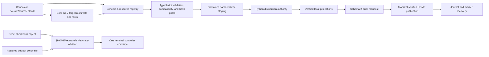

# System Architecture

**Last Updated**: 2026-09-01  
**Project**: EVCrate  
**Status**: Phase 6 registry and explicit-import contracts complete; release remains Unreleased

## Scope

EVCrate has two cooperating planes:

1. The TypeScript/npm control plane parses bounded requests, validates target and
   policy data, exposes filesystem transaction primitives, and delegates the
   distribution actions.
2. The Python distribution plane remains authoritative for target generation,
   build/check, HOME publication, and recovery.

Canonical Claude resources are authored under `.evcrate/source/.claude/`.
Generated target projections are derived artifacts. Phase 6 adds a
schema-v1 resource registry and explicit import transaction; it does not claim
publication or live cutover, Python-free completion, HOME support for imports,
Windows security equivalence, or unverified deployment behavior.

## Architecture at a glance



The controller path is a separate shared advisory service. It is not a
per-target projection, distribution broker, or settings mutation path.

## Ownership and component boundaries

| Component | Source | Responsibility | Authority |
|---|---|---|---|
| Canonical resources | `.evcrate/source/.claude/` | Agent, command, hook, workflow, and skill authoring | Repository author |
| Target registry | `.evcrate/targets/manifest.json` and target manifests | Persisted target IDs, adapters, roots, patches, overlays, and HOME policy | Schema-2 manifest contract |
| TypeScript control plane | `src/cli/`, `src/context/`, `src/protocol/`, `src/manifests/` | One-shot CLI, strict contracts, context, manifest/build authorization | Typed validation boundary |
| Resource registry | `src/registry/` | Schema-v1 canonical resource records, manifest-root scanning, compatibility, bounded list/get, and registry revisions | Canonical source plus manifest-derived roots |
| Explicit imports | `src/imports/` | Bounded source descriptors, capability approvals, preview tokens, adapter projections, and CAS-bound apply | Typed resource protocol |
| TypeScript transactions | `src/filesystem/`, `src/distribution/`, `src/advisor-settings/` | Paths, hashes, locks, staging, promotion, policy CAS, recovery, and import atomicity | Reusable safety primitives |
| Python distribution | `distribution/`, `distribute.py` | Generation, build/check, publication, and recovery | Authoritative distribution engine |
| Generated projections | `.evcrate/source/.agents`, `.codex`, `.gemini`, `.antigravity`, `.omp`, `.copilot`, `.pi` | Target-specific derived trees | Never hand-edited |
| Shared advisor controller | `.evcrate/source/.evcrate/bin` → `$HOME/.evcrate/bin` | Checkpoint qualification and one final advisory invocation | Existing CommonJS controller |

The TypeScript bridge invokes package-relative `python3 distribute.py` with one
exact action and the resolved state-root handoff. It does not invoke migrators
directly or provide a TypeScript fallback.

The target manifest registry contains exactly seven persisted targets. `agy` is
accepted only at the input boundary and normalizes to `antigravity`; it is never
stored as a second target.

| Target | Local output roots | Adapter | HOME binding | Promotion order |
|---|---|---|---|---:|
| `gemini` | `.gemini` | `migrate_claude_to_gemini.py` | `.gemini` | 10 |
| `codex` | `.codex`, `.agents` | `migrate_claude_to_codex.py` | `.codex`, `.agents` | 20 |
| `pi` | `.pi` | `migrate_claude_to_pi.py` | `.pi` | 25 |
| `antigravity` | `.antigravity` | `migrate_claude_to_gemini.py` | `.gemini/config` | 30 |
| `omp` | `.omp` | `migrate_claude_to_omp.py` | `.omp` | 30 |
| `claude` | `.claude` | none | `.claude` | 40 |
| `copilot` | `.copilot` | `migrate_claude_to_copilot.py` | `.copilot` | 40 |

The shared controller is an additional `.evcrate/bin` publication binding at
order 5. It is not copied into a target harness.

## Phase 6 resource registry and explicit imports

Phase 6 separates resource discovery from distribution declarations. The target
manifest remains schema 2 and authoritative for target adapters, output/HOME
ownership, and promotion policy. Its single `resource_roots` map declares the
five canonical resource roots (`skill`, `agent`, `workflow`, `command`, and
`hook`). The resolver retains the manifest-derived `resourceRoot` assumption:
it reads `.evcrate/targets/manifest.json`, infers the repository from that
path, and resolves each declared root below `.evcrate/source/.claude`. The
implementation does not imply support for alternate layouts or arbitrary roots.

The separate `.evcrate/registry.json` is schema 1. A document contains an
integer revision and canonical, code-point-sorted resource records. Each record
has a stable `kind:canonical-relative-path` ID, source path, mode-aware content
hash, provenance, all seven persisted-target compatibility entries, detected
capabilities, optional model metadata, and a record revision. It does not copy
target manifests, output roots, HOME bindings, controller files, or advisor
policy.

### Discovery and queries

Scanning checks owner-controlled canonical roots, rejects symlinks and special
entries, and hashes the canonical tree before discovering resources. Granularity
is explicit: skills are directories containing `SKILL.md`; agents and workflows
are root-level Markdown files; commands are Markdown files below their root;
hooks are root-level files or directories. Sensitive path segments are excluded
from discovery. Record count, document size, tree depth, file count, byte, and
path limits bound the work, and entries are sorted by Unicode code-point order.
`resources.list` accepts kind/target/status filters, a code-point cursor, and a
bounded limit (default 50, maximum 100). `resources.get` resolves one validated
resource ID. A loaded document is rescanned and compared for content,
capability, compatibility, ownership, and revision consistency; stale or empty
registries cannot hide an existing canonical tree.

Compatibility is derived from the registered projection adapters, not supplied
by an import caller. The registry requires an exhaustive seven-target adapter
set and records `native`, `needsAdapter`, or `unsupported` with a reason for
unsupported entries. Missing adapters or incompatible selected targets fail
closed before projection work.

### Preview, approval, and apply

`imports.preview` is explicit and non-mutating with respect to canonical source,
the registry, target manifests, generated projections, controller files,
advisor policy, HOME paths, and managed settings. It validates a bounded source
descriptor, copies canonical source into an owner-only staging root, materializes
the proposed resource there, rescans it, and runs selected adapters into
separate temporary output stages. Hooks and script content are classified but
never executed. The only durable preview state is an owner-only, single-use
token under `stateRoot/import-previews`; its canonical record is bounded to
128 KiB and expires after a caller-selected lifetime from 1 to 900 seconds
(default 300).

Source imports are bounded to 1,000 files, 64 MiB total, 16 MiB per file, 100,000
directories, depth 32, and 4 KiB per relative path. Sources must be regular
files/directories with stable device/inode/size/mode metadata and no unsafe
ancestors. Executable bits, script suffixes, and shebangs require explicit
`script-execution` approval; every hook requires `hook-execution` approval.

An apply loads and validates the owner-only token, rejects expiry or replay, and
recomputes every preview binding before mutation: source hash/identity, canonical
current/prospective hashes, registry revision/file identity, selected targets,
target-registry and manifest hashes, adapter hashes, projection output hashes,
destination, provenance, approvals, and resource record. Source identity includes
device/inode/size/mode; registry identity includes digest plus those metadata;
complete canonical hashes include file and directory modes; promotion snapshots
include node kind, device/inode, size, mode, and digest. A mode-only change is
therefore a CAS conflict.

For a create or update, canonical source and `.evcrate/registry.json` are
promoted as one staged, same-volume transaction under the publication lock.
Durable backup/journal state and pre-backup/pre-promotion CAS checks prevent a
concurrent replacement from being overwritten; the token is consumed only after
success. An identical re-import returns `unchanged`, consumes its token, and
does not advance the registry revision.

| Destination state | Import result |
|---|---|
| No registry record and no destination node | Create a managed record and node. |
| Existing record with the same provenance and matching kind | Replace in staging; report `update` or `unchanged`. |
| Existing record with different provenance, or a kind mismatch | `CAS_CONFLICT`; preserve the existing node. |
| Destination node without a matching managed record | `CAS_CONFLICT`; never delete or adopt unmanaged content. |

The residual security scope remains the low same-UID/path-race window and
Linux-first security scope. The manifest-derived `resourceRoot` assumption and
the separate Python publication authority remain explicit boundaries.

## One-shot TypeScript control-plane flow

```text
CLI argv or one request file
        │
        ▼
strict argument/request parsing
        │
        ▼
immutable package, target, HOME, state, and project context
        │
        ▼
one typed dispatch
  ┌─────┼──────────┬────────────┐
  ▼     ▼          ▼            ▼
version health settings     distribution
        │          │            │
        ▼          ▼            ▼
 diagnostic   typed boundary  Python bridge
        │          │            │
        └──────────┴────────────┘
                   ▼
       validate and write one result
                   ▼
                  exit
```

The CLI has no listener, daemon, retry loop, background worker, counsel proxy,
arbitrary launcher, or Node distribution fallback. Child processes use fixed
argument arrays, `shell: false`, allowlisted environment, bounded streams and
lines, deadlines, abort handling, descendant cleanup, and reaping.

## Phase 4 distribution-safety architecture

### Manifest and build authorization

Target manifests are schema 2. Their path-bearing values are normalized relative
POSIX paths. Adapter and helper sources must be regular, non-symlink files;
obsolete per-harness advisor-runtime fields are rejected. Output roots are
contained declarations, and selected manifest sets reject equal or nested roots,
so output ownership cannot overlap. HOME bindings must cover declared roots,
remain unique, and respect parent-before-child promotion order.

Patch authorization is checked before a build can be trusted:

- source is a regular file under the target manifest's `patches/` root;
- destination is normalized, unique across patch declarations, and inside one
  declared output root;
- keys are non-empty, unique, valid dotted JSON paths with no empty segments and
  no invalid JSON string text.

Owned source paths are limited to the manifest's `files/` subtree. Project
metadata entries are root-level names. A build manifest is schema 2 and contains
exactly `schema_version`, `source_hashes`, `adapter_hashes`, `controller_hashes`,
`owners`, `output_hashes`, `validation`, and `home_policy`.

The TypeScript build-manifest reader uses a 4 MiB maximum and descriptor-stable
bounded reads. It requires `validation.complete === true`, then compares current
source, adapter, output, and controller hashes. Missing, extra, stale, changed,
symlinked, or malformed inputs fail closed before publication.

### Controller inventory and closure

The sole controller source is `.evcrate/source/.evcrate/bin`. The canonical
inventory is exactly these 17 production files:

```text
evcrate-advisor
lib/advisor/adapter-contract.cjs
lib/advisor/adapter-registry.cjs
lib/advisor/adapters/claude.cjs
lib/advisor/adapters/codex.cjs
lib/advisor/adapters/omp.cjs
lib/advisor/adapters/omp-parser.cjs
lib/advisor/adapters/pi.cjs
lib/advisor/checkpoint-contract.cjs
lib/advisor/controller-envelope.cjs
lib/advisor/controller.cjs
lib/advisor/errors.cjs
lib/advisor/isolated-workspace.cjs
lib/advisor/json-document.cjs
lib/advisor/policy-schema.cjs
lib/advisor/profile.cjs
lib/advisor/runner.cjs
```

The inventory is generated from the Python authority into
`src/manifests/controller-inventory.generated.ts`. Source and projection checks
require regular files, reject symlinks and extra production entries, reject test,
fixture, helper, fake, and ignored artifacts, and require literal imports to
stay inside the listed closure or Node built-ins. The entrypoint must have the
canonical Node shebang and executable mode. `controller_hashes` must contain
exactly the 17 `.evcrate/bin/...` keys and current SHA-256 bytes; a projection
must be byte-identical.

### Python-compatible canonical JSON and hashing

The control-plane serializer matches Python authority behavior for supported
values: object keys sort by Unicode code point, arrays retain order, undefined
object fields are omitted, and numeric/exponent rendering uses Python-compatible
forms. Canonical bytes are UTF-8; build-manifest bytes end with one newline.
SHA-256 is the only digest algorithm.

The strict parser accepts only object or array roots. Before validation it rejects
invalid UTF-8, control characters, unpaired surrogates, duplicate object keys,
non-finite numbers, trailing JSON data, and nesting deeper than 16 levels. JSON
and canonical documents remain bounded at 64 KiB by default. Tree hashes include
empty directories and file digests in global lexical path order; symlinks and
unsupported entries fail closed. Local dependency/compiler artifacts are
excluded according to source/artifact hash mode.

### Paths, ownership, and staged roots

Path helpers reject absolute paths, backslashes, NULs, dot/dot-dot or empty
segments, symlinked ancestors, non-regular entries, and escapes from a declared
root. Managed roots and ancestors must be real owner-controlled directories;
owner-only modes apply to transaction state on POSIX.

Build/promotion sources must come from a capability-backed staged root on the
same volume as the destination parent. The staged-root capability records its
path plus device/inode identity and is checked before use. Cleanup verifies the
same owner-controlled directory, atomically renames it to a random quarantine
name, rechecks identity, and only then removes it. If the path was replaced,
cleanup refuses recursive deletion.

### Durable promotion and recovery

Promotion snapshots each source and destination (presence, kind, device/inode,
size, mode, and digest), creates a 0700 backup directory, and writes an owner-
only durable journal. Immediately before every backup or promotion rename it
rechecks the relevant snapshot. A source or destination change is a CAS failure;
concurrent replacements are never overwritten.

The journal records contained backup and destination paths, original presence,
intended source hashes, and commit state. Promotion commits the journal only
after all roots are moved, syncs the parent directory, and removes backups only
after success. Recovery validates owner, symlink, containment, and digest
invariants, restores the prior complete set for an interrupted transaction, and
leaves unexpected user replacements untouched. Committed deletions remain
deletions.

### Shared locks and release state

The publication critical section uses an owner-only state directory and a shared
`O_EXCL` JSON lock. TypeScript exposes `publish.lock` plus a dedicated
`advisor-settings.lock`; Python's `publish_lock` uses the same publication lock
shape and metadata. Lock metadata is bounded to 4 KiB and contains a safe PID,
millisecond start time, random 32-hex token, and optional process-start token.

On Linux, `/proc/<pid>/stat` process-start data detects PID reuse. A valid stale
lock is atomically renamed to a random quarantine path, re-read, matched by
token/device/inode identity, and removed. Malformed, changing, or uncertain
metadata blocks acquisition. Release removes a lock only if token and
 device/inode identity still match; otherwise it leaves the lock for recovery.

The release marker is owner-only schema-1 JSON, atomically written and bounded
at 4 MiB. Missing state yields an explicit empty marker. Symlinked, malformed,
unsupported, oversized, or unstable marker data fails closed.

### Advisor policy-file transaction boundary

Advisor policy files are bounded at 16 KiB and must be owner-only regular files
without symlinked ancestors. Reads return a validated safe policy view, canonical
bytes, mode, and a revision derived from file metadata and bytes. Staging checks
the expected revision and writes canonical bytes to a sibling staging file.

Apply writes `prepared`, `backed_up`, and `promoted` journal states, performs
source/destination revision CAS checks before backup and promotion, moves the old
complete document to an identity-checked backup, promotes the staged document,
verifies bytes and mode, then clears journal and backup state. Recovery restores
the previous complete policy or accepts a fully promoted document; unsafe
transaction paths and replacement directories fail closed. The CLI
`advisor settings get|preview|apply` remains a typed
`CAPABILITY_UNSUPPORTED` boundary with no policy reads or writes in this phase.

## Shared advisor controller boundary

Checkpoint workflows send one direct ten-field
`evcrate-advisor-checkpoint/v1` object to the managed
`$HOME/.evcrate/bin/evcrate-advisor`. The required user-owned policy is one
version-1 advisor object; there is no host-route fallback, caller-selected
executable, callback broker, retry, backend switch, model substitution, or local
fallback. The controller qualifies one configured adapter, runs one final model
process in an empty owner-only workspace, and emits one frozen terminal envelope.

The controller is authored once, published as a complete directory, and covered
by the exact inventory/hash closure above. Generated target roots do not own a
controller copy. See [Advisor distribution architecture](./advisor-distribution-architecture.md)
for the full controller and operator qualification contract.

## Python-authority publication boundary

The Python engine consumes the verified local artifact and manifest, preserves
unmanaged HOME data, applies declared target policies, and records durable
release state. Publication is separate from generation: the TypeScript CLI does
not run migrators, and a failed build or stale hash cannot replace local or HOME
artifacts. Recovery is explicit and uses the persisted marker/journal state.

The implementation has no claim of Python-free parity. Deterministic tests do not
qualify installed vendor CLIs, authorize live publication, or establish Windows
security equivalence. Remaining review residuals are the low same-UID/path-race
window and Linux-first security scope.

## Evidence and release boundary

Focused implementation evidence records `npm run build` exit 0 and **85/85**
across the Phase 6 (**23/23**), protocol (**19/19**), Phase 4 (**31/31**),
and Phase 5 (**12/12**) focused commands. These contract results do not claim
publication, live cutover, HOME support, Python-free completion, or deployment
behavior.

The remaining security scope is Linux-first, with the low same-UID/path-race
window retained as the documented residual.

## Related documentation

- [Codebase Summary](./codebase-summary.md)
- [Code Standards](./code-standards.md)
- [Project Overview and PDR](./project-overview-pdr.md)
- [Advisor distribution architecture](./advisor-distribution-architecture.md)
- [Advisor supervision migration](./advisor-supervision-migration.md)
- [Native Pi migration](./pi-native-migration.md)
- [Repository changelog](../CHANGELOG.md)
